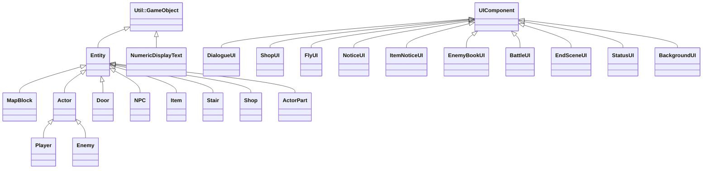
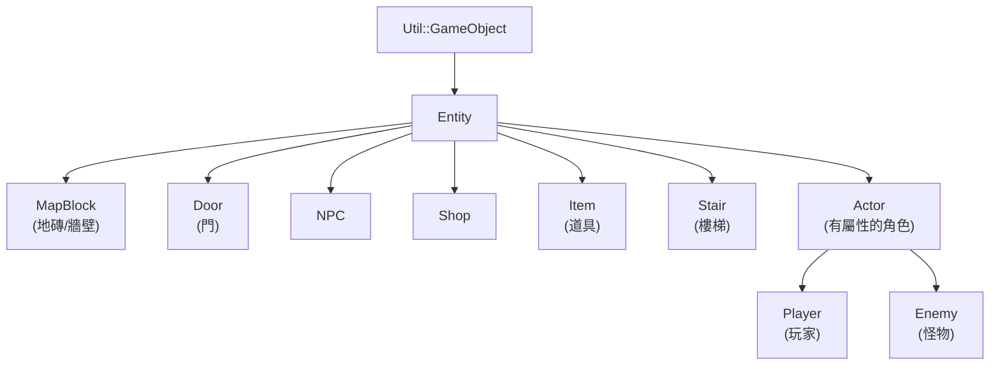
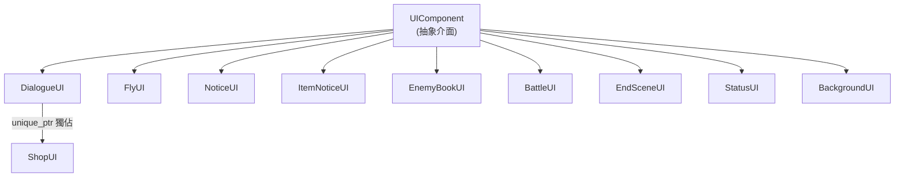
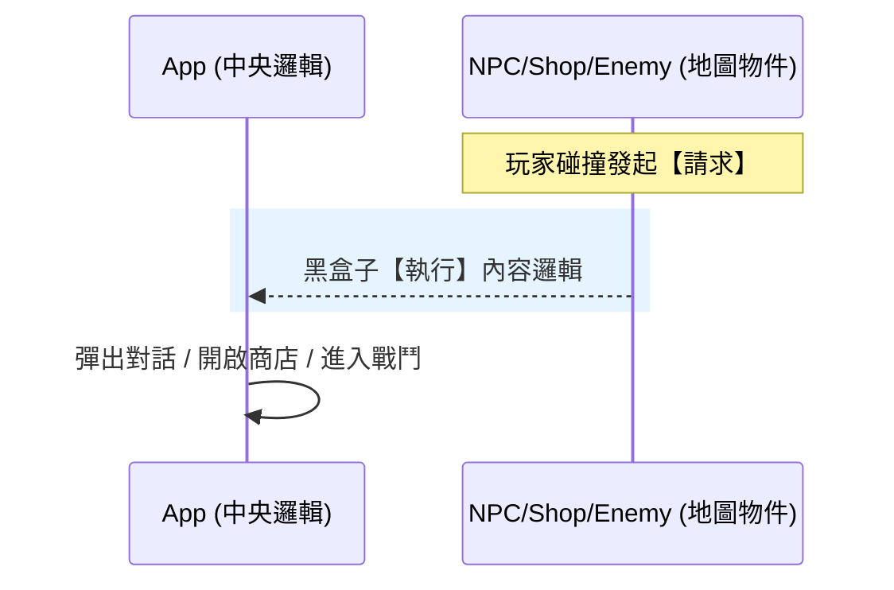
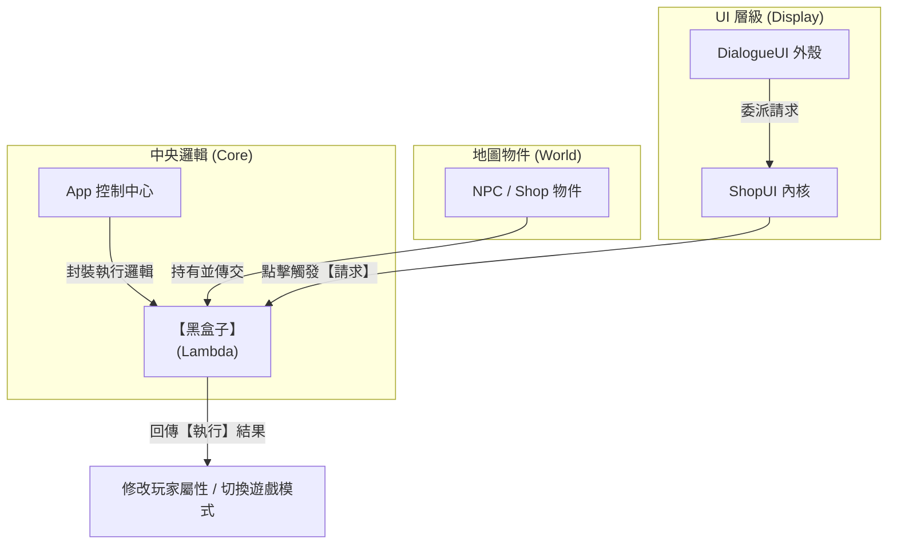

# 2026 OOPL Final Report

## 組別資訊

- 組別：42
- 組員：113820030 呂翊詳
- 復刻遊戲：魔塔

## 專案簡介

### 遊戲簡介

- 復刻經典遊戲魔塔，原本為地上 20 層，地下 25 層以及 10 關隱藏關卡，本次製作地上 20 層魔塔以及 5 關隱藏關卡，在劇情上做了一些調整。

### 組別分工

- 我是一人組，遊戲一個人實作。

## 遊戲介紹

### 遊戲規則

#### 遊戲目標

解救公主，遊戲結局分為兩種

| 結局 | 說明 |
|------|------|
| 勝利 | 解救公主 |
| 失敗 | 體力歸零(或是低於 0) |

#### 按鍵說明

- `Space` - 確認(但若 UI 有顯示其他按鍵請以 UI 的為主)
- `上下左右` - 操縱勇者移動
- `R` - 直接重新開始 (沒有確認，注意使用)
- `Q` - 撤退（攻擊中使用）
- `L` - 開啟按鍵說明(再按一次關閉)
- `F` - 開啟電梯（獲得指定道具後使用，但隱藏關卡無法使用）
- `D` - 開啟心鏡（查看預估攻擊怪物的數值，限獲得指定道具後使用）
- `G` - 切換超級長頸鹿模式提高攻擊、防禦力、金幣、經驗、體力、敏捷，可供高攻擊傷害與測試商店，並可直接使用電梯與心鏡
    - 再按一次時恢復原本勇者屬性，基本上屬性不互通(除以下例外)，注意吃到道具時的角色狀態
    - 不過衰弱與中毒狀態兩者設計是互通的
- `I` - 凍結戰鬥(再按一次解開)
- `8` - 直接強制原地上樓
- `2` - 直接強制原地下樓

#### 屬性說明

| 屬性 | 說明 |
|------|------|
| 體力 (HP) | 歸零即遊戲結束 |
| 攻擊力 (ATK) | 決定對敵人的基礎傷害 |
| 防禦力 (DEF) | 減少敵人對自己的傷害 |
| 敏捷 (AGI) | 每次被攻擊時，有 AGI% 機率閃避該次傷害 |
| 等級 (LV) | 就單純等級，無任何作用 |
| 經驗值 (EXP) | 打怪獲得，商店購物使用 |
| 金幣 (Coin) | 商店購物使用 |
| 黃/藍/紅鑰匙 | 分別用來開啟對應顏色的門 |

#### 戰鬥機制

每一回合流程：**勇者攻擊敵人 1 次 → 敵人攻擊勇者 N 次（N 由敵人的攻擊段數決定，本次實作範圍是 1~3 次），一律勇者先攻**

**勇者攻擊敵人：**
- 傷害 = 勇者攻擊力 − 敵人防禦力，最低為 1
- 若勇者處於「衰弱」狀態，該回合攻擊力先 × 0.8 再去與敵人相減
- 有（敵人敏捷）% 的機率使敵人完全閃避本次攻擊（傷害為 0）

**敵人攻擊勇者（每段獨立計算）：**
- 傷害 = 敵人攻擊力 − 勇者防禦力，最低為 1
- 若敵人具「無視防禦」能力，傷害直接等於敵人攻擊力
- 若勇者處於「衰弱」狀態，該回合防禦力先 × 0.8 再去與敵人相減
- 有（勇者敏捷）% 的機率閃避本次傷害（閃避成功則跳過所有狀態判定）
- 若敵人有「必殺攻擊」特殊能力，每次攻擊有 10% 機率直接擊殺勇者
- 若敵人有「衰弱」特殊能力，命中後有 9% 機率令勇者進入衰弱狀態
- 若敵人有「中毒」特殊能力，命中後有 9% 機率令勇者進入中毒狀態

**戰鬥結束（擊敗敵人）：**
- 獲得敵人的經驗值與金幣
- 敵人從地圖上消失（部分敵人死後會觸發下一隻敵人或獎勵地圖）

#### 狀態異常

| 狀態 | 效果 | 解除方式 |
|------|------|---------|
| 衰弱 | 攻擊力和防禦力在打架時會 x0.8 再去與敵人相減 | 吃火酒 |
| 中毒 | 每一輪動畫週期扣 1 點體力，最低保留 1 點（不致死） | 吃抗毒劑 |

- 衰弱與中毒可同時存在，狀態欄顯示「衰弱中毒」
- 超級模式下衰弱/中毒的觸發邏輯不變，但因 HP 極高實際影響可忽略
- 衰弱與中毒狀態是正常模式與超級模式共享

#### 門的種類

| 門的種類 | 消耗鑰匙 |
|---------|---------|
| 黃門 | 黃鑰匙 ×1 |
| 藍門 | 藍鑰匙 ×1 |
| 紅門 | 紅鑰匙 ×1 |
| 綠門 | 黃、藍、紅鑰匙各 ×1 |
| 鐵柵欄 | 無需鑰匙 |

#### 樓梯機制

- 踩上「上樓梯」即前往上一層樓
- 踩上「下樓梯」即前往下一層樓
- 特定樓梯可傳送至指定座標（用於隱藏關卡或非線性路徑）
- debug:
    - 按 8 強制原地上樓
    - 按 2 強制原地下樓

#### 商店機制

**神像商店（地圖上固定位置）：**
- 貪婪之神：
    - 費用公式：第 N 次購買費用 = 20 + N，超超過第 25 次後每次額外再 +4
- 戰鬥之神：購買防禦力提升（花費經驗值）
- 同種神像的交易次數全地圖共用（跨樓層）

**NPC 商店（由對話觸發）：**
- 每位 NPC 有獨立的交易次數計數，不與其他樓層的同款 NPC 互通
- 部分 NPC 商店有最大交易次數限制，達到上限後無法再購買

### 遊戲畫面

| 說明 | 畫面 |
|---------|---------|
| 待機畫面 |      |
| 遊戲一開始 |      |
| 按鍵說明 |      |
| NPC 對話 |      |
| 對戰 |      |
| 對戰獲勝 |      |
| 撿到道具 |      |
| 大商店交易 |      |
| NPC商店購買 |      |
| 敵人圖鑑 |      |
| 獲得負面狀態 |      |
| 電梯 |      |
| 巨大怪物 |      |
| 假公主 |      |
| 公主 |      |
| 勝利 |      |
| 死亡 |      |
| 長頸鹿好幫手 |      |

## 程式設計

### 程式架構

#### 繼承架構圖 (Hierarchy Overview)

這是一份省略屬性與方法的純繼承關聯圖，供快速掌握類別層級關係：

以下的點代表繼承、數字代表詳細解釋

* `Util::GameObject` - PTSD 中的基礎遊戲物件
  * `Entity` - 地圖上所有互動物件的通用基底
    * `MapBlock` - 地圖上的靜態障礙物 (牆壁、岩漿、水)
    * `Actor` - 擁有生命與攻防等數值屬性的動態角色
      * `Player` - 玩家角色
      * `Enemy` - 地圖上的怪物
    * `Door` - 地圖上需要消耗鑰匙開啟的門
    * `NPC` - 地圖上可對話的角色
    * `Item` - 地圖上的消耗性或裝備道具
    * `Stair` - 地圖上的樓梯 (負責樓層切換)
    * `Shop` - 地圖上的商店
    * `ActorPart` - 巨型敵人的身體部位
  * `NumericDisplayText` - 顯示數字的文字元件 (StatusUI 的子元件)
* `UIComponent` - 所有使用者介面的通用基底，管理渲染與生命週期
  * `DialogueUI` - 負責對話文本與選項渲染
  * `ShopUI` - 商店的商品選單
  * `FlyUI` - 樓層跳躍介面 (隨意門)
  * `NoticeUI` - 中央提示訊息框
  * `ItemNoticeUI` - 獲得道具時的提示框
  * `EnemyBookUI` - 怪物圖鑑 (計算攻防傷害與預估耗血)
  * `BattleUI` - 戰鬥畫面
  * `EndSceneUI` - 遊戲結局畫面
  * `StatusUI` - 側邊狀態欄 (顯示血量、鑰匙、攻防)
  * `BackgroundUI` - 遊戲背景層 (取代原本的靜態背景圖片)

### 程式技術

本專案的核心設計思想是：**地圖物件只負責「發起請求」，由中央控制中心（App）負責「具體處理」。**

#### 一、中央請求與統一調度 (依賴注入完成職責分離)

##### 1. 核心機制：黑盒子 (std::function & Lambda)
我們利用 C++ 的 `std::function` 作為容器，將邏輯封裝在「黑盒子」中。
- **封裝 (Encapsulation)**：在 `App.cpp` 初始化時，將涉及 UI 切換、數值修改的邏輯寫入 Lambda 並塞入黑盒子。
- **注入 (Injection)**：透過 `EntityFactory` 將這些黑盒子發送到各個地圖物件（NPC, 商店）手中。
- **調用 (Execution)**：當 `Reaction` 觸發時，物件端只需執行一行 `m_on_trigger(...)`。這意味著物件**不需要了解**如何開商店或改數據，它只需負責「按鈕」被按下的那一瞬間。
- **反向操作 (Reverse Interaction)**：調用時，物件會將自己 (`shared_from_this()`, `*this`) 傳回黑盒子。這讓中央邏輯在處理請求時，仍能回頭操作發起請求的物件（例如讓門播放縮放動畫、或讓 NPC 改換圖片）。

##### 2. 實體繼承體系 (Entity Hierarchy)
所有地圖物件共享一套多型繼承架構，透過虛函式鏈實現「統一介面、各自實作」：

###### 關鍵虛函式鏈 (Virtual Method Chain)
| 虛函式 | 職責 | 覆寫代表 |
| :--- | :--- | :--- |
| `Reaction()` | 被玩家觸發時的核心行為 | 所有互動物件皆覆寫 |
| `CheckCondition()` | 互動前的條件檢查（例如是否有鑰匙） | `Door` |
| `ObjectUpdate()` | 每幀邏輯更新（動畫同步、狀態監控） | `Entity`(同步), `Player`(走路), `Door`(開門) |
| `InterruptsMovementSync()` | 是否在互動後中斷玩家移動流程 | `Stair`(絕對傳送) |
| `ShouldSkipWalkAnimation()` | 是否跳過玩家的走路動畫 | `Stair` |

###### 設計分層
- **Entity (基底)**：提供格位座標、可通行性、動畫基礎設施、`Reaction` 虛函式介面。所有地圖物件의 共同語言。
- **Actor (中間層)**：為「擁有數值屬性」的角色（玩家、怪物）新增 `m_attributes` 字典與 `GetAttr/SetAttr/ApplyEffect` 統一存取介面。
- **具象類別**：各自覆寫 `Reaction` 等虛函式，實現專屬行為（NPC 觸發對話、Door 扣鑰匙播動畫、Enemy 發起戰鬥）。

##### 3. UI 繼承體系 (UI Component Hierarchy)
所有使用者介面皆繼承自單一抽象基底 `UIComponent`，確保了渲染與狀態更新的生命週期能被統一調度。

###### 統一的生命週期介面
- **`run()`**: 每個 UI 必須實作的更新與渲染主迴圈。
- **`IsIntercepting()`**: 決定該 UI 顯示時，是否攔截地圖背後的點擊與玩家移動操作。
- **閃爍與可見度管理**: 內建了統一的閃爍計時器 `UpdateBlinkTimer()` 與可見度旗標 `m_visible`，消除各 UI 中重複的計時變數。

###### UI 元件的組合與委派 (Composite & Delegation)
在 UI 層級，我們也實現了職責分離：
- **組合模式 (Composite)**：`DialogueUI` 以 `std::unique_ptr` 獨佔持有 `ShopUI`。`ShopUI` 並不在 `App` 的頂層 UI 管理向量中，而是作為 `DialogueUI` 的**私有內部零件**存在。`DialogueUI` 像是一個外殼（Facade），負責統一對外的介面。
- **委派模式 (Delegation)**：當進入商店狀態，`DialogueUI` 將控制權委派給內部的 `ShopUI` 處理按鍵與渲染。
- **擁有權語意精準 (Ownership Semantics)**：頂層 UI（由 `App` 管理）使用 `shared_ptr`，因為 `App` 同時以向量迴圈與具名成員兩種方式存取；而內部子元件（如 `ShopUI`）使用 `unique_ptr`，明確表達「只有一個擁有者」的獨佔語意，避免不必要的參考計數開銷。

> [!NOTE]
> **設計理由：為何 ShopUI 不獨立存在？**
> 在原版魔塔中，所有商店互動的視覺呈現本質上都是「對話框的一種特殊模式」——不管是大商店還是小商人，畫面上都是同一套對話框外殼（標題文字、邊框、背景圖），差別僅在於底部的選項內容不同。因此，`ShopUI` 只需負責「選項列表的渲染與按鍵處理」這件純粹的事，而外框的繪製與進場/退場動畫則統一由 `DialogueUI` 管理。若將 `ShopUI` 拉出去獨立，反而會導致兩邊各自維護一套重複的外框渲染邏輯。

##### 4. 直接回調技術避免第三方指標引入的錯亂 (Direct Callback)
經過架構重構，凡是需要「跨系統通訊」的地圖互動（如 NPC、商店、怪物、樓梯、道具等），皆已統一汰換為「直接回調」模式。

###### 跨系統通訊的全面直接回調 (Comprehensive Direct Callback)
物件被觸發時，**立刻**向黑盒子發起請求。例如：**樓梯**會立刻請求 App 切換樓層；**商店**會立刻請求 App 準備商品資料並開啟 UI。

###### 直接回調機制的優勢 (Advantages of Direct Callback)
- **職責乾淨 (High Decoupling)**：地圖物件 (如 `Shop`, `NPC`) 完全不需要知道「UI 是什麼、怎麼畫的」，只需保管並觸發按鈕，徹底達成邏輯與顯示的分離。

> [!NOTE]
> **架構巧思：並非所有物件都需要 Callback (權限最小化原則)**
> 如果有互動物件本體及玩家以外的「第三者」需要介入（例如需要開啟 UI 介面、切換場景），就會在中央管理器 `App` 設置一條線（Callback）接收請求去調用該第三者；如果不需要的話（例如 **門 Door**），透過 `Reaction` 裡接收到玩家本身的數據直接修改就好。這種「需要什麼權限，才給什麼按鈕」的設計，確保了不需要聯外溝通的輕量級實體能保持絕對單純。

###### 職責分離圖解：集中化請求與隨插即用
下圖展示了這套系統如何讓多個層級（包含上述提到的 UI 組合）透過「黑盒子」協同運作，而不需要互相 `#include` 參考代碼：

#### 二、大地圖與樓層管理技術 (Large Map & Floor Management)

本專案採用了高效的空間索引與按需加載技術，確保在擁有數十層樓的情況下仍能保持低記憶體消耗與流暢體驗。

##### 1. 空間管理：3D 物件矩陣 (3D Entity Matrix)
所有的地圖資料存儲於一個三維向量結構中：`vector<vector<vector<shared_ptr<Entity>>>>`。
- **維度設計**：`[樓層 Story][縱軸 Y][橫軸 X]`。
- **優勢**：提供 $O(1)$ 的空間查詢效率。當玩家移動或 `EnemyBookUI` 掃描地圖時，能以極速獲取特定座標的物件。

##### 2. 效能優化：延遲載入 (Lazy Loading)
為了縮短遊戲啟動時間並節省記憶體，地圖並非一次性載入。
- **按需解析**：只有當玩家進入某樓層，或代碼請求獲取該樓層物件時，`EnsureFloorLoaded` 才會觸發 CSV 解析與物件實例化。
- **狀態緩存**：一旦樓層被載入，其物件狀態就會保留在記憶體中，直到遊戲重啟。

##### 3. 快速切換：層級可見度控制
樓層切換（上樓/下樓）並非銷毀舊物件並重建新物件，而是透過 **「可見度撥動 (Visibility Toggle)」**：
- **切換邏輯**：將當前樓層所有 `Entity` 的 `SetVisible` 設為 `false`，並將目標樓層設為 `true`。
- **好處**：瞬時完成切換，無須負擔繁重的 `Renderer` 資源重新分配。

##### 4. 動態地圖變更：物件原地取代 (In-place Object Replacement)
遊戲進行中會發生大量的地圖變動（如消耗鑰匙開門、拾取血瓶、擊殺怪物），本系統並非採用粗暴的「隱藏 (Hide)」或「重載地圖」，而是實作了精準的指標替換機制：
- **指標覆寫 (Pointer Overwrite)**：當物件生命週期結束時（例如 `Door` 的開門動畫播完），會呼叫 `TriggerReplacement(0)`（0 代表空地磚 `Road`）。系統會直接在 3D 矩陣中定位該物件的座標 `[story][y][x]`，並將該位置 the `shared_ptr<Entity>` **重新指向 (Reassign)** 一個全新的 `Road` 實體。
- **無縫記憶體回收**：得益於 `shared_ptr` 的特性，當原本的怪物或門被新的空地磚覆寫後，其參考計數 (Reference Count) 會歸零並自動觸發解構子 (Destructor) 釋放記憶體。這確保了地圖矩陣永遠保持最輕量、最乾淨的狀態，不會殘留任何「幽靈物件」。

#### 三、動畫同步與獨立運作技術 (Animation System)

魔塔專案中存在兩種截然不同的動畫運作邏輯，分別解決「場景整齊感」與「個體互動反饋」的需求。

##### 1. 同步動畫：全域時鐘同步 (Global Sync)
**適用對象**：`MapBlock` (岩漿/水流)、`NPC`、`Shop`、`Enemy`。
- **運作機制**：
    1. **廣播索引 (Index Instruction)**：`TileAnimationManager` 扮演廣播電台角色，根據全域時間計算出當前應顯示的 **影格索引 (Index)**。
    2. **主動對齊 (Pull Mode)**：在每幀更新 (`ObjectUpdate`) 時，物件並不運行內部計時器，而是主動向管理器請求 Index，並透過 `SetCurrentFrame(index)` 強制同步。
    3. **狀態獨立，資源共享**：雖然大家的 Index 一致，但每個物件仍持有獨立的動畫狀態；而底層的圖片資源則透過 `shared_ptr` 共享，兼顧了同步感與記憶體效率。
- **價值**：確保地圖上所有的 NPC、商店或動態地磚都能「整齊劃一」地閃爍或呼吸，避免畫面因隨機啟動的動畫而顯得混亂。

##### 2. 獨立動畫：事件觸發與單次執行 (Independent)
**適用對象**：`Player` (走路動畫)、`Door` (開門動畫)。
- **運作機制**：
    1. **事件觸發 (Event Trigger)**：平時處於靜止狀態，僅在特定事件（如 `Reaction` 或 `Move`）發生時手動呼叫 `Play()` 啟動。
    2. **狀態監控 (State Tracking)**：物件在 `ObjectUpdate` 中持續監控動畫狀態。關鍵在於攔截 `Util::Animation::State::ENDED` 訊號。
    3. **物理聯動 (Lifespan Linkage)**：動畫的結束通常伴隨著物理狀態的改變。例如「門」在動畫結束後會執行 `TriggerReplacement(0)`，將自己從地圖移除，這讓視覺上的「開啟」與物理上的「消失」緊密結合。
- **價值**：
    - **高響應性**：確保操作回饋與玩家輸入同步。
    - **流程控制**：利用動畫播放時間作為邏輯延遲，實現更自然的物件互動（例如慢慢開啟後才允許通過）。

#### 四、系統健壯性與資料驅動架構 (System Robustness & Data-Driven Architecture)

在整體的專案健康度評估中，本架構具備極高的穩定性與擴充性，這歸功於現代 C++ 特性與資料驅動的設計理念。

##### 1. 記憶體管理與安全性 (Memory Management)
專案全面棄用傳統的 `new`/`delete`，改以 RAII (Resource Acquisition Is Initialization) 慣例為基礎的智慧指標系統：
- **資源生命週期管理**：`App` 透過 `std::vector<std::shared_ptr<UIComponent>>` 統一管理 UI；`FloorMap` 透過三維陣列統一管理 `std::shared_ptr<Entity>`。當樓層切換或 UI 關閉時，不需手動釋放資源，有效杜絕 Memory Leak (記憶體洩漏)。
- **安全的自我參照**：核心基底 `Entity` 繼承了 `std::enable_shared_from_this<Entity>`。這保證了在互動回呼中（例如 NPC 將自身傳遞給對話系統），不會產生雙重釋放 (Double Free) 或懸空指標。
- **防禦性程式設計 (Defensive Programming)**：在屬性修改的底層統一管線 (`Actor::ApplyEffect`) 中實作了邊界檢查 (Clamp 防呆)，確保生命值 (HP) 等關鍵屬性在扣除時絕不會低於零，避免數值溢位或遊戲邏輯崩潰。

##### 2. 高度資料驅動 (Data-Driven Design)
為了與程式邏輯解耦，遊戲內的內容物盡可能外包給資料檔案：
- **地圖 CSV 載入與動態覆蓋 (Overlay)**：地圖結構完全由外部 CSV 定義，並支援 `LoadOverlay` 動態改變地圖區塊（如開門、觸發機關），無須重新編譯 C++ 程式碼。
- **全域物件註冊表 (Global Object Registry)**：怪物的攻防數值、道具的加成效果，皆由 CSV 載入至 `AppUtil::GlobalObjectRegistry` 中。新增怪物或道具只需更新資料檔，系統便會自動綁定 ID，具備極強的資料擴充性。

##### 3. 基於復刻特性的架構取捨 (Constraint-based Optimizations)
本專案為忠實復刻原版魔塔，利用了原版遊戲的特性（約束條件）進行了針對性的極簡優化，而非盲目套用大型通用遊戲引擎的厚重模式：
- **UI 單一互動 (IsIntercepting)**：原版遊戲不允許 UI 疊加，因此我們僅使用一個簡單的布林值 `IsIntercepting()` 迴圈來暫停地圖更新與輸入。這不僅省去了複雜耗能的 Event System 或 Focus Manager，效能也最佳。
- **玩家中心碰撞判斷**：原版遊戲中怪物與道具皆為靜態（不主動移動），唯一的移動實體只有玩家。因此，我們將碰撞判斷的職責直接賦予 `Player`，讓 `Player` 查詢 `FloorMap` 目標格是否 `IsPassable()`。這種直覺的設計（KISS 原則）降低了系統複雜度，是最符合該遊戲機制的實作。

#### 五、嚴謹的物件導向設計原則 (SOLID & OOP Principles)

本專案不僅是一個遊戲實作，更是物件導向設計核心精神的具體展現，以下列出幾個最具代表性的實踐面向：

##### 1. 多型與統一介面 (Polymorphism)
- **設計亮點**：在玩家移動 (`Player::Move`) 的碰撞判定中，我們不寫任何 `if (isNPC)` 或 `if (isEnemy)` 的髒代碼 (Spaghetti Code)。
- **運作方式**：我們定義了 `Entity::Reaction()` 這個虛擬介面。玩家不管撞到什麼，都只會盲目地呼叫 `target->Reaction(PlayerPtr)`。是門就會自己扣鑰匙、是怪物就會自己發起戰鬥、是 NPC 就會觸發對話。這完美體現了物件導向中「**開放封閉原則 (OCP)**」——未來新增任何新地圖物件，玩家的移動碰撞程式碼一行都不用改。

##### 2. 漸進式繼承與職責拆分 (Inheritance Hierarchy)
- **設計亮點**：遵守「單一職責原則 (SRP)」，不讓基礎類別過度膨脹。
- **運作方式**：我們設計了 `Entity` 作為最底層（只管座標與動畫），並從中分支出 `Actor` 這個中間層（專門管理攻防數值）。因此，`Door` 或 `Stair` 繼承 `Entity`，保持極度輕量；而 `Player` 與 `Enemy` 則繼承 `Actor`，自動擁有了數值管理的能力。這確保了子類別只繼承他們真正需要的屬性。

##### 3. 高度封裝與屬性字典 (Data Encapsulation)
- **設計亮點**：棄用傳統的 `public int hp, atk, def;` 暴露變數。
- **運作方式**：把所有屬性封裝在一個基於 Enum (`AppUtil::Effect`) 的字典中，並強制透過 `GetAttr` 與 `ApplyEffect` 來存取。這不僅大幅縮減了變數宣告的篇幅，更讓我們可以集中在一個地方撰寫防呆機制（例如 HP Clamp），展現了強大的「**資料封裝 (Encapsulation)**」與收斂能力。

##### 4. 權限最小化原則 (Principle of Least Privilege)
- **設計亮點**：物件「自給自足」，不索取不需要的系統權限。
- **運作方式**：以「門 (Door)」為例，它打開只需要消耗玩家的鑰匙，這件事它可以透過 `Reaction` 傳入的 Player 指標自己算完，所以我們不配給它中央控制室的 Callback 按鈕；相對地，商店與 NPC 需要呼叫外掛的 UI 介面，我們才在工廠配發 Callback。這種「依需求配給資源」的設計，確保了基礎地圖物件的高度內聚性 (High Cohesion)。

### 使用到 AI/AI Agent 的部分

在本專案中，我採用了現代的「**Vibe Coding (意圖導向與直覺式編程)**」模式與 AI Agent 協作。有別於直接要求 AI 生成零散的程式碼，我將 AI 視為「系統架構顧問」，並建立了一套高效的協作與除錯迴圈：

1. **獨立思考核心問題，定義基礎物件架構**：
   開發皆由我對遊戲邏輯的理解出發。在處理「地圖與玩家互動」這個核心命題時，我確立了所有互動的基礎：必須存在一個通用的 `Entity` 類別作為指標互動的媒介（`Reaction(shared_ptr<Player>)`），讓所有地圖物件有共通對話語言。此骨架完全由人類主導。

2. **提出初步方案，與 AI 進行架構碰撞與探索**：
   當遇到複雜的跨系統通訊需求（如踩樓梯切換地圖、撞商店開啟 UI），我會先提出初步構想，並向 AI 探討其在 C++ 記憶體管理與效能上的可行性，同時要求 AI 提出更進階的現代 C++ 替代方案。

3. **綜合比較與決策，確立最終實作方案**：
   取得 AI 建議後，我會進行優劣分析（如輪詢與事件驅動的利弊），最終決策採用「直接回調機制 (Direct Callback)」，並由我制定「權限最小化原則」。決策完成後，才將具體的重構與除錯任務交由 AI 輔助完成。

4. **圖文並茂的精確定位除錯 (Context-Rich Debugging)**：
   在開發與測試的除錯階段，我常將「終端機錯誤輸出」與「遊戲視窗異常畫面」一同截圖並提供給 AI。這種結合系統日誌與視覺表現的雙重上下文，能協助 AI 極速還原問題現場，診斷如 UI 渲染偏差、資料綁定錯誤、或因編譯環境更新所引起的編譯中斷。

5. **規範前置的知識傳承機制 (Spec-Driven Workflow)**：
   若開發過程中有特定的宣告規範或代碼約束（例如類別命名規則、Adapter 解耦方式等），我會先建立獨立的規格文件（如 `Agents.md`）加以記錄，並在正式開始編寫或重構前，要求 AI 優先閱讀並嚴格遵守。這項做法能保證 AI 在產生程式碼時始終符合專案的架構約束，避免長久開發造成的設計漂移。

6. **架構藍圖的動態維護機制 (Active Architecture Blueprint)**：
   我會建立並在有開發進度時隨時更新 Constructure.md 文件。此文件詳盡記錄了專案的所有類別架構、成員方法與核心元素。這不僅方便我自身隨時快速查閱與掌握整體結構，更是一份提供給 AI 隨時搜索並快速建構理解上下文的「即時藍圖」，極大地提升了人類與 AI 在大規模代碼迭代時的協作同步率。

**總結**：透過這個以人類大腦為主導、AI Agent 為強大執行器的協作模式，AI 補足了我在底層語法與高階設計模式上的經驗落差，而我則始終掌握著專案的最高控制權與架構品味，達成極高的程式碼品質與系統健壯度。

## 結語

### 問題與解決方法

### 自評

| 項次 | 項目                   | 完成 |
|------|------------------------|-------|
| 1    | 這是範例 |  V  |
| 2    | 完成專案權限改為 public |  V  |
| 3    | 具有 debug mode 的功能  |    |
| 4    | 解決專案上所有 Memory Leak 的問題  |    |
| 5    | 報告中沒有任何錯字，以及沒有任何一項遺漏  |    |
| 6    | 報告至少保持基本的美感，人類可讀  |    |

### 心得

### 貢獻比例

