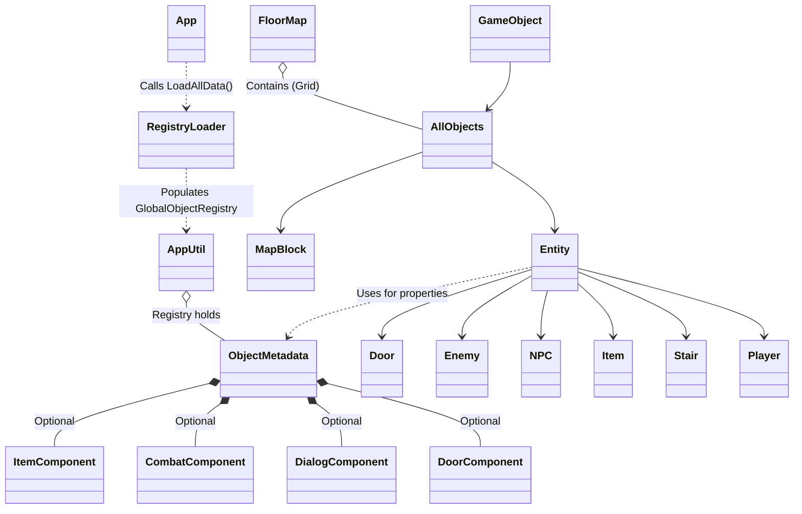
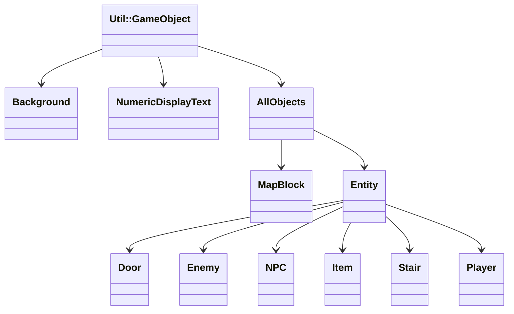

# 魔塔專案架構概覽

### 繼承關係圖

---

架構設計方案：

類別架構 (Entity 系統)

一、基底物件 (`AllObjects`)
- 繼承 `Util::GameObject`
- 提供所有地圖物件的基礎：`ObjectId`、座標 (`Transform`)、顯隱控制。
- **統一通行性判斷**：提供 `virtual bool IsPassable()` 與成員 `m_is_passable`。
- 虛擬函數：`ObjectUpdate()`。

二、實體系統 (`Entity` 系統)
- 繼承 `AllObjects`。
- **互動基類**：繼承並實作 `virtual void Reaction(Player*) = 0;`。
- **通行性**：繼承自 `AllObjects`，預設為 `false` (阻擋)。
- **實作分離**：所有衍生實體 (`Stair`, `Shop`, `Item` 等) 一律採用 `.hpp` 聲明與 `.cpp` 實作分離模式。
- **數據驅動與組件化架構**：
    - 核心：`AppUtil::GlobalObjectRegistry` 管理所有物件的元數據 (`ObjectMetadata`)。
    - **組件化設計 (Component-based)**：`ObjectMetadata` 採用插槽式設計，包含 `ItemComponent`、`CombatComponent`、`DialogComponent` 與 `DoorComponent`。物件僅在需要時掛載對應組件，避免結構臃腫。
    - **動態加載機制**：透過 `AppUtil::RegistryLoader` 在遊戲啟動時從 `Block.csv`, `Item.csv`, `Door.csv`, `Stair.csv` 等外部檔案自動填充註冊表。
    - **資源定位**：透過 `AppUtil::GetIdResourcePath(id)` 自動從註冊表獲取屬性並動態合成路徑 (例如：`{401, "slime", "Enemy"}` -> `"/bmp/Enemy/slime.bmp"`)。
- **多型衍生**：
    1. **`Player` (主角)**：
        - 繼承自 `Entity`，由 `App` 持有。
        - 負責處理 `Util::Input`、背包系統、數值計算。
        - **座標同步**：直接使用繼承自 `Entity` 的 `m_grid_x/y` 成員 (無 Shadowing)。
        - **Z-Index 設定為 -3**。
    2. **`Character` (角色/怪物/NPC)**：包含 `NPC`, `Enemy` 等。
    3. **`Item` (道具)**：包含鍵、藥水等。
    4. **`Stair` (樓梯)**：具備 `m_on_trigger` 回調函式，觸發時呼叫 `App::ChangeFloor`。設定 `m_is_passable = true`。

三、層級控制 (Z-Index 渲染順序)
- **Z = 90 ~ 95 (UI 頂層選單)**：`MenuUI` 及其子物件 (說明書、電梯、怪物手冊)。
- **Z = -0.1 (UI 提示層)**：`StatusUI` 的操作提示文字。
- **Z = -3 (主角層)**：單一 `Player` 實例。
- **Z = -4 (物件層)**：`ThingsMap` (怪物、道具、NPC、樓梯)。
- **Z = -5 (地板層)**：`RoadMap` (牆壁、地板)。

地圖系統 (FloorMap 3D 結構)

一、多樓層存儲與切換
- 使用 **3D 陣列 `[story][y][x]`** 支援多樓層。
- **`App::ChangeFloor(int delta)`**：中心化切換邏輯，同步更新 `RoadMap`, `ThingsMap` 的樓層指標，並觸發 `Player->SyncPosition`。
- **`App::TeleportToFloor(int story, int stairId)`**：智慧傳送邏輯。會自動在目標樓層搜尋指定 ID 的樓梯座標（如 701-上樓、702-下樓），並將玩家定位於該座標。

二、物件管理
- `FloorMap` 透過 `BlockFactory` 根據 ID 動態生成對應的衍生類別。
- **物件搜尋法 (`FindFirstObjectPosition`)**：支援在指定樓層中搜尋第一個符合 ID 的網格座標，為電梯傳送提供基礎。
- **排版校準 (ID 0 Sampling)**：系統會取樣 ID 0 (映射為 road 資源) 的尺寸來決定全地圖 11x11 網格的基礎間距，確保精準對齊。
- `Stair` 在建立時會被注入 lambda 閉包，使其能安全觸發 `App` 的樓層切換方法。

三、交互觸發流程
1. `Player` 嘗試移動。
2. 檢查 `RoadMap` 是否可通行 (`IsPassable`)。
3. 如果目標位置在 `ThingsMap` 有物件，呼叫該物件的 `Reaction()`。
4. **穿透與阻擋條件**：
    - 若物件為不可通行且 Reaction 後仍為 `Visible`，則阻擋移動。
    - 若物件 `IsPassable()` 為 `true` (如樓梯、物品)，則允許重疊。
4. 根據 `Reaction()` 結果決定移動是否成功或觸發特殊事件。

四、UI 系統 (文字與數值顯示)
- **`NumericDisplayText`**：
    - 繼承自 `Util::GameObject`。
    - **格式**：`Prefix` + `Number` + `Suffix` (例如：`m_Number` + `" F"` 顯示樓層)。
    - **更新機制**：手動呼叫 `UpdateDisplayText()` 渲染文字。
- **`StatusUI` (狀態管理器)**：
    - **中心化更新**：集中管理黃/藍/紅鑰匙數量與樓層顯示。
    - **封裝邏輯**：`App` 僅需呼叫 `m_StatusUI->Update(player, story)` 即可完成所有 UI 同步。
    - **字體配置**：支援建構時注入預設字體大小，靈活調整排版。

六、選單與說明系統 (`MenuUI`)
- **整合管理模式**：將所有「覆蓋選單」由單一 `MenuUI` 類別管理，根據計時與 `GameState` 切換子面板。
- **模態對話框 (`ITEM_DIALOG`)**：新增 `ITEM_DIALOG` 遊戲狀態。當觸發道具對話時，遊戲會進入此狀態並暫停移動與動畫，直到玩家按下 `Space/Enter` 確認。
- **子組件包含**：
    - **Notice Panel**：顯示 `notice.bmp` 背景，支援全畫面覆蓋與遊戲暫停。
    - **Fast Elevator Panel**：包含樓層顯示、導引箭頭與操作提示文字。
    - **Item Notice Panel**：顯示 `itemDialog.bmp` 背景、獲得物品的文字，以及 `-Space-` 操作提示。
    - **未來擴充**：預留「怪物手冊」顯示槽位與資源。
- **動態回饋**：根據選單類型的數值 (如電梯樓層) 動態切換箭頭顏色及文字內容。

五、數據驅動層 (`AppUtil::RegistryLoader`)
- **單一事實來源 (Single Source of Truth)**：整合 ID、名稱、資源目錄、通行性、動畫幀數及各類型組件數值。
- **多樣化效果 (`Effect`)**：支援 `HP`, `ATK`, `DEF`, `AGI`, `EXP`, `Level`, `Keys`, `Coins`, `Weak`, `Poison` 等多種道具效果。
- **動態解析**：使用 `AppUtil::MapParser::ParseCsvToStrings` 進行複雜屬性數據的載入。
- **擴充性**：新增遊戲物件或修改數值只需調整 `Datas/Data/` 下的 CSV 檔案，無需修改任何 C++ 代碼或重新編譯。
- **特殊鎖定**：ID 0 (道路) 於程式碼中硬編碼保留，確保基礎地景渲染的穩定性。
