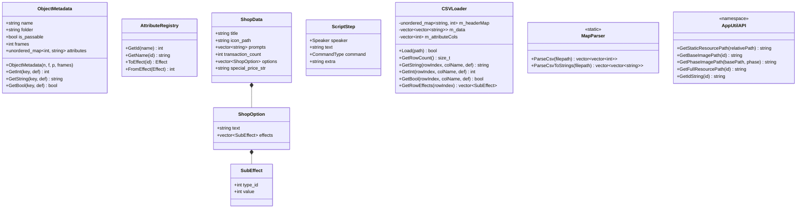
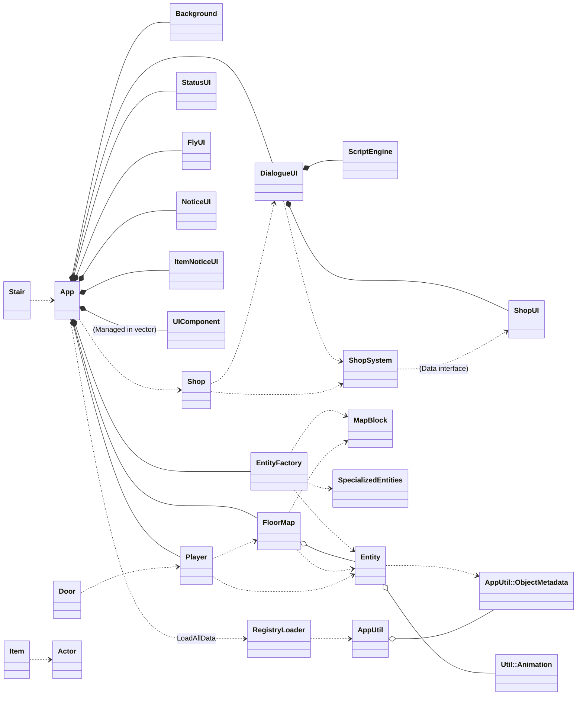

# 魔塔專案架構概覽

## 完整類別圖（繼承、屬性、方法）

```mermaid
classDiagram
    direction TB

    class GameObject["Util::GameObject"] {
        +Transform m_Transform
        #shared_ptr~Drawable~ m_Drawable
        #bool m_Visible
        +SetDrawable(drawable)
        +SetZIndex(z)
        +SetVisible(bool)
    }

    class UIComponent {
        <<interface>>
        +virtual run()*
        +virtual IsIntercepting()* bool
        +virtual IsActive()* bool
        +virtual SetVisible(bool)*
        +virtual AddToRoot(Renderer)*
    }

    class Entity {
        #int m_object_id
        #bool m_is_passable
        #shared_ptr~Animation~ m_animation
        #string m_base_image_path
        #int m_grid_x
        #int m_grid_y
        #bool m_can_react
        #bool m_is_movable
        #shared_ptr~DynamicReplacementComponent~ m_replacement_comp
        +Entity(id, imagePath, canReact)
        +virtual ~Entity()
        +virtual SetObjectId(int newId)
        +GetObjectId() int
        +virtual ObjectUpdate()
        +virtual IsPassable() bool
        +SetPassable(bool)
        #SetupAnimation(id, looping, intervalMs)
        +virtual Reaction(shared_ptr~Player~)
        +SetReplacementComponent(shared_ptr)
        +TriggerReplacement(targetId)
        +SetGridPosition(x, y)
        +GetGridX/Y() int
        +SetMovable(bool)
        +GetMovable() bool
        +SetCanReact(bool)
        +CanReact() bool
        +virtual ShouldSkipWalkAnimation() const bool
        +virtual CheckCondition(shared_ptr~Player~) const bool
        +ForEachAttribute(callback) const
    }

    class DialogueUI {
        -Mode m_mode
        -ScriptEngine m_engine
        -unique_ptr~ShopUI~ m_shop_ui
        -shared_ptr~Player~ m_player
        -float m_blink_timer
        +DialogueUI(ItemNoticeUI)
        +SetPlayer(shared_ptr~Player~)
        +StartScript(name, source, isShop)
        +StartShop(name, ShopData, onSelect, source)
        +run() override
        +IsIntercepting() bool override
        +IsActive() bool override
        +SetVisible(bool) override
        +AddToRoot(Renderer) override
    }

    class ShopUI {
        -vector~shared_ptr~NumericDisplayText~~ m_options
        -shared_ptr~GameObject~ m_selector
        -shared_ptr~NumericDisplayText~ m_price_display
        -AppUtil::ShopData m_data
        -int m_selection
        -bool m_visible
        -float m_blink_timer
        +ShopUI(fontPath)
        +Start(ShopData, onSelect)
        +run() override
        +IsIntercepting() bool override
        +IsActive() bool override
        +SetVisible(bool) override
        +Refresh(ShopData)
    }

    class FlyUI {
        -shared_ptr~GameObject~ m_fly_bg
        -shared_ptr~NumericDisplayText~ m_floor_text
        -shared_ptr~NumericDisplayText~ m_enter_text
        -shared_ptr~NumericDisplayText~ m_quit_text
        -shared_ptr~GameObject~ m_up_arrow
        -shared_ptr~GameObject~ m_down_arrow
        -bool m_visible
        -float m_blink_timer
        +FlyUI()
        +Start(currentStory, callback)
        +run() override
        +IsIntercepting() bool override
        +IsActive() bool override
        +SetVisible(bool) override
        +AddToRoot(Renderer) override
    }

    class NoticeUI {
        -shared_ptr~GameObject~ m_notice_bg
        -shared_ptr~NumericDisplayText~ m_close_hint
        -bool m_visible
        -float m_blink_timer
        +NoticeUI()
        +run() override
        +IsIntercepting() bool override
        +IsActive() bool override
        +SetVisible(bool) override
        +AddToRoot(Renderer) override
    }
    
    class ItemNoticeUI {
        -bool m_visible
        -shared_ptr~GameObject~ m_item_notice_bg
        -shared_ptr~NumericDisplayText~ m_item_notice_text
        -shared_ptr~NumericDisplayText~ m_item_confirm_text
        -float m_blink_timer
        +ItemNoticeUI()
        +Show(text)
        +run() override
        +IsIntercepting() bool override
        +IsActive() bool override
        +SetVisible(bool) override
        +AddToRoot(Renderer) override
    }

    class Actor {
        #unordered_map~Effect, int~ m_attributes
        +Actor(id, imagePath, canReact)
        +GetAttr(Effect) int
        +SetAttr(Effect, value)
        +ApplyEffect(Effect, delta)
        +MeetsRequirement(Effect, amount) bool
        +virtual OnAttributeChanged(Effect)
    }

    class MapBlock {
        +MapBlock(int initialId)
        +GetImageSize() vec2
        -GetImagePath(int) string
    }

    class Player {
        -PlayerDirection m_direction
        -bool m_is_animating
        -shared_ptr~Animation~ m_animations[4]
        -int m_pending_shop_id
        +Player()
        +Move(dx, dy, roadmap, thingsmap)
        +SyncPosition(roadmap)
        +Reaction(player) override
        +ObjectUpdate() override
        +GetPendingShop() int
        +SetPendingShop(id)
        +ResetStateAfterFloorChange()
        +SetDirection(PlayerDirection)
        +SetIsAnimating(bool)
        +OnAttributeChanged(Effect) override
    }

    class Door {
        +Door(int id)
        +CheckCondition(player) const bool override
        +Reaction(player) override
        +ObjectUpdate() override
    }

    class Enemy {
        +Enemy(int id)
        +Reaction(player) override
    }

    class NPC {
        -TalkCallback m_talk_callback
        +NPC(id, TalkCallback)
        +Reaction(player) override
    }

    class Trigger {
        -TriggerCallback m_trigger_callback
        +Trigger(id, TriggerCallback)
        +Reaction(player) override
    }

    class Item {
        -NoticeCallback m_notice_callback
        +Item(int id, NoticeCallback)
        +Reaction(player) override
    }

    class Stair {
        -TriggerCallback m_on_trigger
        +Stair(id, callback)
        +Reaction(player) override
        +ShouldSkipWalkAnimation() bool override
    }

    class Shop {
        -AppUtil::ShopData m_session_data
        -int m_transaction_count
        -bool m_is_open
        +Shop(id, onOpen, onClose)
        +Reaction(player) override
        +Open(player, DialogueUI, floor)
        +Close(DialogueUI)
        #BuildShopData(floor)
        #CanAfford(ShopOption, Player) bool
        #ExecutePurchase(ShopOption, player)
    }

    class Background {
        +Background()
        +NextPhase(int phase)
        +SetLoadingFrame(int frame)
    }

    class NumericDisplayText {
        -shared_ptr~Text~ m_text_drawable
        -string m_prefix
        -string m_suffix
        -int m_number
        -bool m_needs_update
        +NumericDisplayText(fontPath, fontSize)
        +SetPrefix(string)
        +SetSuffix(string)
        +SetNumber(int)
        +UpdateDisplayText()
    }

    %% ── 繼承關係 ──
    GameObject <|-- Entity
    GameObject <|-- Background
    GameObject <|-- NumericDisplayText
    Entity <|-- MapBlock
    Entity <|-- Door
    Entity <|-- NPC
    Entity <|-- Item
    Entity <|-- Stair
    Entity <|-- Shop
    Entity <|-- Trigger
    Entity <|-- Actor
    Actor <|-- Player
    Actor <|-- Enemy
    UIComponent <|-- DialogueUI
    UIComponent <|-- ShopUI
    UIComponent <|-- FlyUI
    UIComponent <|-- NoticeUI
    UIComponent <|-- ItemNoticeUI
```

## 非繼承類別（管理器與 UI）

```mermaid
classDiagram
    direction TB

    class App {
        -STATE m_current_state
        -GameState m_game_state
        -Renderer m_root
        -shared_ptr~Background~ m_background
        -shared_ptr~FloorMap~ m_road_map
        -shared_ptr~FloorMap~ m_things_map
        -shared_ptr~StatusUI~ m_status_ui
        -shared_ptr~Player~ m_player
        -shared_ptr~FlyUI~ m_fly_ui
        -shared_ptr~NoticeUI~ m_notice_ui
        -shared_ptr~DialogueUI~ m_dialogue_ui
        -vector~shared_ptr~UIComponent~~ m_ui_components
        -float m_item_notice_timer
        -float m_loading_timer
        -int m_loading_frame
        -Shop* m_active_shop
        -unique_ptr~EntityFactory~ m_entity_factory
        +GetCurrentState() STATE
        +Start()
        +Update()
        +End()
        +ChangeFloor(int delta)
        +TeleportToFloor(int story, int stairId)
        +ShowItemNotice(string)
        +HideItemNotice()
        +Restart()
        -ValidTask()
        -InitializeGame()
    }

    class FloorMap {
        -ObjectFactory m_factory
        -vector~vector~vector~shared_ptr~Entity~~~~ m_objects
        -int m_current_story
        +FloorMap(factory, centerX, centerY, scaleX, scaleY, zIndex)
        +LoadAllFloors(prefix)
        +LoadFloorData(floorData, story)
        +SwitchStory(story)
        +GetObject(x, y, story) Entity
        +IsPassable(x, y, story) bool
        +SetObject(x, y, id, story)
        +SetAllVisible(visible)
        +SetRenderer(root)
        +AddToRenderer()
        +Update()
        +GetCurrentStory() int
        -UpdateObjectAt(x, y, id, story)
        -GetGridAbsolutePosition(x, y) vec2
    }


    class StatusUI {
        -shared_ptr yellow/blue/red_key_text
        -shared_ptr coin/level/hp/attack/defense/agility/exp/floor_text
        -shared_ptr manual_hint_text
        -shared_ptr~Player~ m_player
        -shared_ptr~FloorMap~ m_road_map
        -bool m_visible
        -unsigned int m_default_font_size
        +StatusUI(Player, FloorMap, fontSize)
        +run() override
        +IsIntercepting() bool override
        +IsActive() bool override
        +SetVisible(bool) override
        +AddToRoot(Renderer) override
        -InitNumericText(text, x, y, color, size)
    }

    class DynamicReplacementComponent {
        -ReplacementCallback m_callback
        +DynamicReplacementComponent(callback)
        +ReplaceWith(x, y, id)
    }

    class RegistryLoader {
        <<static>>
        +LoadAllData()
        +LoadSettings(path)
        +LoadObjectCSV(path, folder, passable)
    }

    class TileAnimationManager {
        <<namespace>>
        +GetGlobalFrame2(ms) int
    }

    class ScriptEngine {
        -vector~ScriptStep~ m_steps
        -size_t m_current_step
        +LoadScript(name)
        +Advance() ScriptStep
        +Peek() ScriptStep
        +Next()
        +IsEnd() bool
    }

    class ShopSystem {
        <<static>>
        +LoadFromStaticFile(name) ShopData
        +LoadForShopEntity(id, floor, transCount) ShopData
    }

    class EntityFactory {
        -Callbacks m_callbacks
        -shared_ptr~DynamicReplacementComponent~ m_replacement_comp
        +EntityFactory(Callbacks)
        +CreateEntity(id) shared_ptr~Entity~
        +CreateRoadBlock(id) shared_ptr~Entity~
        +SetReplacementComponent(shared_ptr)
    }
```

## 資料結構與元件 (AppUtil Namespace)

## 系統架構組件關係圖

---

## 一、互動實體基類 (`Entity`)
- 繼承 `Util::GameObject`。
- **統一驅動核心**：`SetObjectId(int)` 現在負責從 `GlobalObjectRegistry` 載入所有屬性與動畫資源。
- **解耦行為標記與預覽**：
  - `ShouldSkipWalkAnimation()`：行為標記，決定玩家進入此格子時是否跳過走路動畫（用於樓梯）。
  - `CheckCondition(player)`：**互動預覽**，在 `Player::Move` 執行 Reaction 前進行資格檢查（如門的鑰匙、怪物的能力值）。預設回傳 `true`。
- **屬性解析工具**：提供 `ForEachAttribute(callback) const`，集中處理從 CSV 屬性到 Effect Enum 的類型安全轉換。
- **混合動畫架構**：
  - `m_animation`：持有一個 `Util::Animation` 實體。
  - `SetupAnimation()`：工具方法，自動從 CSV `frames` 欄位與 `AppUtil` 路徑解析器建立動畫。
- **自動同步**：`ObjectUpdate()` 提供預設實作，若物件處於 `PAUSE` 狀態且 `frames > 1`，則自動與 `TileAnimationManager` 的全域時鐘同步。

## 二、地圖區塊 (`MapBlock`)
- 繼承 `Entity`。最精簡的地磚物件，完全依賴基底類別處理渲染與同步。
- **Z-Index**：固定為 -5。
- **方法**：僅保留 `GetImageSize()`。

## 三、實體衍生與策略
- **動畫策略**：
  - **NPC、Shop、Enemy**：與場景同步控制（Global Sync）。
  - **Item、Stair、Trigger**：單幀靜態顯示（Static）。
- **覆寫方法**：不再需要覆寫 `SetObjectId` 與 `ObjectUpdate`，完全複用基底類別邏輯。

## 四、多型衍生實體 (Entity 子類)

### 4.0 `Actor` (屬性引擎基類)
- 繼承 `Entity`。所有具備屬性（HP、ATK、DEF 等）實體的共同基類。
- **核心介面**：提供 `ApplyEffect` 與 `MeetsRequirement` 作為通用的資源操作介面。

### 4.1 `Player` (主角)
- 繼承 `Actor`。
- **核心邏輯**：整合了邊界檢查、`RoadMap` 碰撞與 `ThingsMap` 互動。
- **動畫驅動**：`ObjectUpdate` 負責驅動玩家的四方向行走與靜止圖切換。

### 4.2 `Door` (門)
- **數據驅動**：不再手動判斷鑰匙類型，完全透過 `ForEachAttribute` 與 `CheckCondition` 進行通用資源扣除。

### ... (NPC, Enemy, Item, Stair, Shop, Trigger 保持既有邏輯架構)

## 五、背景 (`Background`)
- 繼承 `Util::GameObject`。管理主要遊戲背景圖與載入遮罩。

## 六、文字顯示 (`NumericDisplayText`)
- 繼承 `Util::GameObject`。封裝 `Util::Text`，提供帶有前綴/後綴的數字動態更新功能。

## 七、動態替換組件 (`DynamicReplacementComponent`)
- 輔助 `Entity` 在執行完 `Reaction` 後（如開門、撿道具）將地圖網格上的 ID 替換為空地（ID 0）。

## 八、地圖系統 (`FloorMap`)
- **封裝管理**：統一管理 0~25 樓的 3D ID 網格，並提供 `SetObject` 與 `SwitchStory` 介面。

## 九、App (遊戲核心控制器)
- **狀態機主軸**：整合所有子系統，控制遊戲在切換樓層、開啟商店與主地圖探索間的流轉。

## 十、UI 模組化介面 (`UIComponent`)
- **全新架構**：為了統一方塊化管理，建立了抽象基類 `UIComponent`。
- **核心機制**：
  - `run()`：執行 UI 的每幀邏輯（包含輸入處理與狀態更新）。
  - `IsIntercepting()`：判定是否停止地圖與主角移動邏輯。
- **統一循環**：`App` 現在維護一個 `std::vector<std::shared_ptr<UIComponent>>`，在 `Update()` 中優先執行。

## 十一、對話與商店系統 (UI 遷移)
### 11.1 `DialogueUI`
- **繼承**：`UIComponent`。
- **職責**：接管對話腳本執行與狀態切換。現在使用單一 `run()` 介面。

### 11.2 `ShopUI`
- **繼承**：`UIComponent`。
- **職責**：專精於商店選項渲染與交互選擇。

## 十二、層級控制 (Z-Index 渲染順序)
| Z-Index | 層級 | 內容 |
|---------|------|------|
| 90 ~ 92 | UI 頂層選單 | `FlyUI` 背景、文字、`NoticeUI` 內容、`DialogueUI` 內容 |
| 15 ~ 16 | 商店選項層 | `ShopUI` 選項與選擇箭頭 |
| -3 | 主角層/狀態層 | `Player` 實例、`StatusUI` 數值 |
| -5 | 地板層 | `RoadMap` 基礎地磚 |

## 十三、數據驅動層 (`AppUtil::RegistryLoader`)
- **Registry 中心**：`GlobalObjectRegistry` 存儲從 CSV 解析的所有物件元數據與屬性，為 `Entity` 資源載入的唯一依據。

## 十四、交互觸發流程
1. `Player::Move()` → 2. `RoadMap` 通行檢查 → 3. `ThingsMap` `CheckCondition()` → 4. 成功移動並觸發 `Reaction()`。

## 十五、實體工廠 (`EntityFactory`)
- **職責**：將複雜的物件創建邏輯從 `App` 中抽離，實現單一職責原則。
- **解耦設計**：透過複數個回呼函數（Callbacks）與 `App` 系統互動，而不需直接引用 `App` 類別。
- **統一介面**：為 `RoadMap` 與 `ThingsMap` 提供一致的物件實例化入口。

## 十六、全域常數與工具
- **`TOTAL_STORY`**: 26 (0~25 樓)。
- **`ResourcePath`**: 統一的資源路徑解析邏輯，支持多副檔名。
