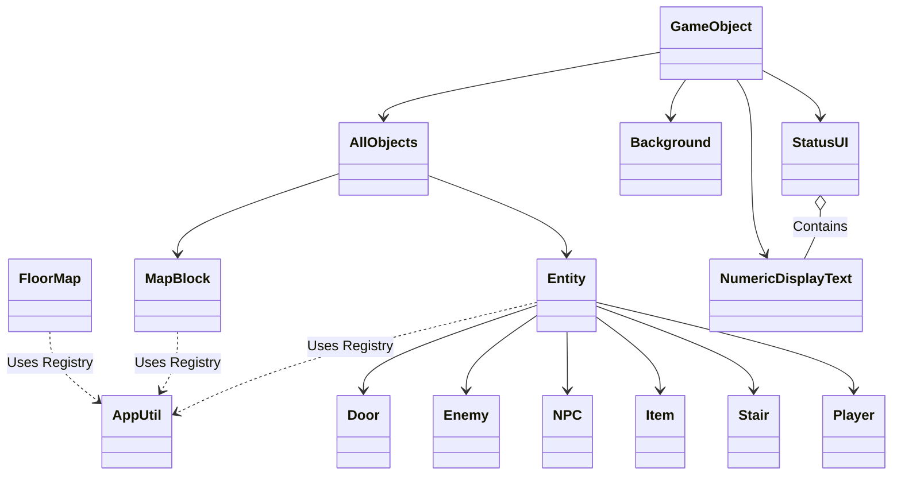

# 魔塔專案架構概覽

架構設計方案：

類別架構 (Entity 系統)

一、基底物件 (`AllObjects`)
- 繼承 `Util::GameObject`
- 提供所有地圖物件的基礎：`ObjectId`、座標 (`Transform`)、顯隱控制。
- **統一通行性判斷**：提供 `virtual bool IsPassable()` 與成員 `m_IsPassable`。
- 虛擬函數：`ObjectUpdate()`。

二、實體系統 (`Entity` 系統)
- 繼承 `AllObjects`。
- **互動基類**：繼承並實作 `virtual void reaction(Player*) = 0;`。
- **通行性**：繼承自 `AllObjects`，預設為 `false` (阻擋)。
- **實作分離**：所有衍生實體 (`Stair`, `Shop`, `Item` 等) 一律採用 `.hpp` 聲明與 `.cpp` 實作分離模式。
- **數據驅動資源機制**：
    - 核心：`AppUtil::GlobalObjectRegistry` 管理所有物件的元數據 (`ObjectMetadata`)。
    - **資源定位**：透過 `AppUtil::GetIdResourcePath(id)` 自動從註冊表獲取屬性並動態合成路徑 (例如：`{401, "slime", "Enemy"}` -> `"/bmp/Enemy/slime.bmp"`)。
    - **屬性自動化**：建構子不再寫死目錄名稱，一律由註冊表驅動，大幅降低代碼重複。
- **多型衍生**：
    1. **`Player` (主角)**：
        - 繼承自 `Entity`，由 `App` 持有。
        - 負責處理 `Util::Input`、背包系統、數值計算。
        - **座標同步**：直接使用繼承自 `Entity` 的 `m_GridX/Y` 成員 (無 Shadowing)。
        - **Z-Index 設定為 -3**。
    2. **`Character` (角色/怪物/NPC)**：包含 `NPC`, `Enemy` 等。
    3. **`Item` (道具)**：包含鍵、藥水等。
    4. **`Stair` (樓梯)**：具備 `m_OnTrigger` 回調函式，觸發時呼叫 `App::ChangeFloor`。設定 `m_IsPassable = true`。

三、層級控制 (Z-Index 渲染順序)
- **Z = -5 (地板層)**：`RoadMap` (牆壁、地板)。
- **Z = -4 (物件層)**：`ThingsMap` (怪物、道具、NPC、樓梯)。
- **Z = -3 (主角層)**：單一 `Player` 實例。

地圖系統 (FloorMap 3D 結構)

一、多樓層存儲與切換
- 使用 **3D 陣列 `[story][y][x]`** 支援多樓層。
- **`App::ChangeFloor(int delta)`**：中心化切換邏輯，同步更新 `RoadMap`, `ThingsMap` 的樓層指標，並觸發 `Player->SyncPosition`。

二、物件管理
- `FloorMap` 透過 `BlockFactory` 根據 ID 動態生成對應的衍生類別。
- **排版校準 (ID 0 Sampling)**：系統會取樣 ID 0 (映射為 road 資源) 的尺寸來決定全地圖 11x11 網格的基礎間距，確保精準對齊。
- `Stair` 在建立時會被注入 lambda 閉包，使其能安全觸發 `App` 的樓層切換方法。

三、交互觸發流程
1. `Player` 嘗試移動。
2. 檢查 `RoadMap` 是否可通行 (`IsPassable`)。
3. 如果目標位置在 `ThingsMap` 有物件，呼叫該物件的 `reaction()`。
4. **穿透與阻擋條件**：
    - 若物件為不可通行且 reaction 後仍為 `Visible`，則阻擋移動。
    - 若物件 `IsPassable()` 為 `true` (如樓梯、物品)，則允許重疊。
4. 根據 `reaction()` 結果決定移動是否成功或觸發特殊事件。

四、UI 系統 (文字與數值顯示)
- **`NumericDisplayText`**：
    - 繼承自 `Util::GameObject`。
    - **格式**：`Prefix` + `Number` + `Suffix` (例如：`m_Number` + `" F"` 顯示樓層)。
    - **更新機制**：手動呼叫 `UpdateDisplayText()` 渲染文字。
- **`StatusUI` (狀態管理器)**：
    - **中心化更新**：集中管理黃/藍/紅鑰匙數量與樓層顯示。
    - **封裝邏輯**：`App` 僅需呼叫 `m_StatusUI->Update(player, story)` 即可完成所有 UI 同步。
    - **字體配置**：支援建構時注入預設字體大小，靈活調整排版。

五、數據驅動層 (`AppUtil::GlobalObjectRegistry`)
- **單一事實來源 (Single Source of Truth)**：整合 ID、名稱、資源目錄、通行性、動畫標記。
- **擴充性**：新增遊戲物件只需在 `AppUtil.cpp` 的 Map 中增加定義，無需修改 `MapBlock` 或 `Entity` 的核心邏輯。
