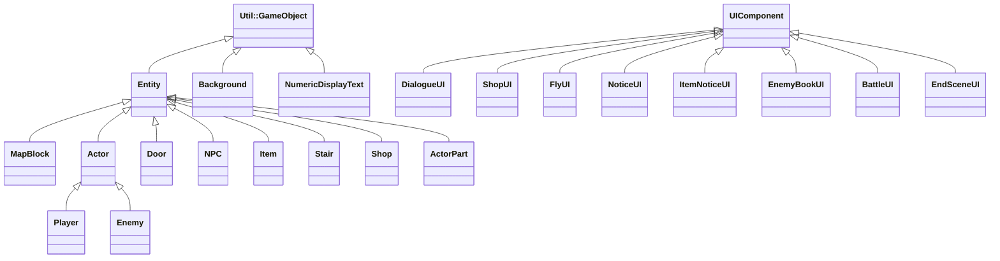
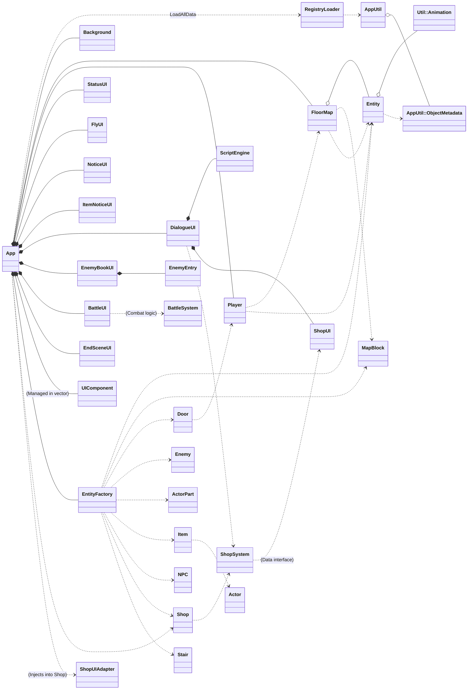

# 魔塔專案架構概覽

## 簡明繼承架構圖 (Hierarchy Overview)

這是一份省略了屬性與方法的純繼承關聯圖，供快速掌握類別層級關係：

## 完整類別圖（繼承、屬性、方法）

```mermaid
classDiagram
    direction TB

    class GameObject["Util::GameObject"] {
        +Transform m_Transform
        #shared_ptr~Drawable~ m_Drawable
        #bool m_Visible
        +SetDrawable(drawable)
        +SetZIndex(z)
        +SetVisible(bool)
    }

    class UIComponent {
        <<interface>>
        #bool m_visible
        +virtual run()*
        +virtual IsIntercepting()* bool
        +virtual IsActive()* bool
        +virtual SetVisible(bool)*
        +virtual AddToRoot(Renderer)*
    }

    class Entity {
        #int m_object_id
        #bool m_is_passable
        #shared_ptr~Animation~ m_animation
        #string m_base_image_path
        #int m_grid_x
        #int m_grid_y
        #bool m_can_react
        #bool m_is_movable
        #shared_ptr~DynamicReplacementComponent~ m_replacement_comp
        +Entity(id, canReact)
        +virtual ~Entity()
        +virtual SetObjectId(int newId)
        +GetObjectId() int
        +virtual ObjectUpdate()
        +virtual IsPassable() bool
        +SetPassable(bool)
        #SetupAnimation(id, looping, intervalMs)
        +virtual Reaction(shared_ptr~Player~)
        +SetReplacementComponent(shared_ptr)
        +TriggerReplacement(targetId)
        +SetGridPosition(x, y)
        +GetGridX/Y() int
        +GetGridPosition() ivec2
        +SetMovable(bool)
        +GetMovable() bool
        +SetCanReact(bool)
        +CanReact() bool
        +virtual ShouldSkipWalkAnimation() const bool
        +virtual CheckCondition(shared_ptr~Player~) const bool
        +virtual InterruptsMovementSync() const bool
        +ForEachAttribute(callback) const
    }

    class DialogueUI {
        -Mode m_mode
        -ScriptEngine m_engine
        -unique_ptr~ShopUI~ m_shop_ui
        -shared_ptr~Player~ m_player
        -float m_blink_timer
        +DialogueUI(ItemNoticeUI)
        +SetPlayer(shared_ptr~Player~)
        +StartScript(name, source, isShop)
        +StartShop(name, ShopData, onSelect, source)
        +SetOnSwitchObject(callback)
        +run() override
        +IsIntercepting() bool override
        +IsActive() bool override
        +SetVisible(bool) override
        +AddToRoot(Renderer) override
    }

    class ShopUI {
        -vector~shared_ptr~NumericDisplayText~~ m_options
        -shared_ptr~GameObject~ m_selector
        -shared_ptr~NumericDisplayText~ m_price_display
        -AppUtil::ShopData m_data
        -int m_selection
        -float m_blink_timer
        +ShopUI(fontPath)
        +Start(ShopData, onSelect)
        +run() override
        +IsIntercepting() bool override
        +IsActive() bool override
        +SetVisible(bool) override
        +Refresh(ShopData)
    }

    class FlyUI {
        -shared_ptr~Player~ m_player
        -int m_current_story
        -int m_preview_floor
        -shared_ptr~GameObject~ m_fly_bg
        -shared_ptr~NumericDisplayText~ m_floor_text
        -shared_ptr~NumericDisplayText~ m_enter_text
        -shared_ptr~NumericDisplayText~ m_quit_text
        -shared_ptr~GameObject~ m_up_arrow
        -shared_ptr~GameObject~ m_down_arrow
        -float m_blink_timer
        +FlyUI()
        +SetPlayer(shared_ptr~Player~)
        +Start(currentStory, callback)
        +run() override
        +IsIntercepting() bool override
        +IsActive() bool override
        +SetVisible(bool) override
        +AddToRoot(Renderer) override
    }

    class NoticeUI {
        -shared_ptr~GameObject~ m_notice_bg
        -shared_ptr~NumericDisplayText~ m_close_hint
        -float m_blink_timer
        +NoticeUI()
        +run() override
        +IsIntercepting() bool override
        +IsActive() bool override
        +SetVisible(bool) override
        +AddToRoot(Renderer) override
    }
    
    class ItemNoticeUI {
        -shared_ptr~GameObject~ m_item_notice_bg
        -shared_ptr~NumericDisplayText~ m_item_notice_text
        -shared_ptr~NumericDisplayText~ m_item_confirm_text
        -float m_blink_timer
        +ItemNoticeUI()
        +Show(text)
        +run() override
        +IsIntercepting() bool override
        +IsActive() bool override
        +SetVisible(bool) override
        +AddToRoot(Renderer) override
    }

    class EnemyBookUI {
        -struct EnemyEntry m_entries[3]
        -vector~int~ m_unique_enemy_ids
        -int m_current_page
        -int m_total_pages
        +EnemyBookUI(player, thingsMap)
        +run() override
        +IsIntercepting() const override
        +IsActive() const override
        +SetVisible(bool) override
        +Unlock() // Set ENEMY_BOOK attribute to 1
        +AddToRoot(Renderer) override
        +Refresh()
    }

    class BattleUI {
        -shared_ptr~Player~ m_player
        -shared_ptr~Enemy~ m_enemy
        -State m_state
        -bool m_is_frozen
        -float m_defeat_timer
        +BattleUI(player, fontPath)
        +Start(player, enemy, onEnd)
        +run() override
        +IsIntercepting() const override
        +IsActive() const override
        +SetVisible(bool) override
        +AddToRoot(Renderer) override
        -RefreshStats()
        -SetAnimation(isPlayerTurn, damage)
    }

    class EnemyEntry {
        -shared_ptr~GameObject~ frame
        -shared_ptr~GameObject~ icon
        -shared_ptr~NumericDisplayText~ name
        -shared_ptr~NumericDisplayText~ special
        -vector~shared_ptr~NumericDisplayText~~ stats
        +Initialize(fontPath, baseY, bgX)
        +SetVisible(bool)
        +AddToRoot(Renderer)
        +Update(ObjectMetadata, Player)
    }

    class Actor {
        #unordered_map~Effect, int~ m_attributes
        +Actor(id, canReact)
        +virtual GetAttr(Effect) int
        +virtual SetAttr(Effect, value)
        +virtual ApplyEffect(Effect, delta)
        +MeetsRequirement(Effect, amount) bool
        +virtual OnAttributeChanged(Effect)
    }

    class MapBlock {
        +MapBlock(int initialId)
        +GetImageSize() vec2
        -GetImagePath(int) string
    }

    class Player {
        -PlayerDirection m_direction
        -bool m_is_animating
        -shared_ptr~Animation~ m_animations[4]
        -int m_pending_shop_id
        -bool m_is_super_mode
        -unordered_map~Effect, int~ m_super_attributes
        +Player()
        +Move(dx, dy, roadmap, thingsmap)
        +SyncPosition(roadmap)
        +Reaction(player) override
        +ObjectUpdate() override
        +GetPendingShop() int
        +SetPendingShop(id)
        +ResetStateAfterFloorChange()
        +SetDirection(PlayerDirection)
        +SetIsAnimating(bool)
        +ToggleSuperMode()
        +GetAttr/SetAttr/ApplyEffect() override
        +OnAttributeChanged(Effect) override
    }

    class EndSceneUI {
        -bool m_is_win
        -shared_ptr~GameObject~ m_end_bg
        -shared_ptr~NumericDisplayText~ m_status_text
        -shared_ptr~NumericDisplayText~ m_restart_hint
        -float m_blink_timer
        +EndSceneUI(fontPath)
        +Show(bool win)
        +CanRestart() bool
        +run() override
    }

    class Door {
        +Door(int id)
        +CheckCondition(player) const bool override
        +Reaction(player) override
        +ObjectUpdate() override
    }

    class Enemy {
        +Enemy(int id)
        +Reaction(player) override
        +OnDefeated() 
    }

    class ActorPart {
        -shared_ptr~DynamicReplacementComponent~ m_replacement_comp
        -int m_core_id
        +ActorPart(id, coreId)
        +Reaction(player) override
        +CheckCondition(player) const override
    }

    class NPC {
        -TalkCallback m_talk_callback
        +NPC(id, TalkCallback)
        +Reaction(player) override
    }



    class Item {
        -NoticeCallback m_notice_callback
        +Item(int id, NoticeCallback)
        +Reaction(player) override
    }

    class Stair {
        -TriggerCallback m_on_trigger
        -bool m_isRelative
        +Stair(id, callback)
        +Reaction(player) override
        +ShouldSkipWalkAnimation() const bool override
        +IsRelative() const bool
        +InterruptsMovementSync() const bool override
    }

    class Shop {
        -AppUtil::ShopData m_session_data
        -int m_transaction_count
        -bool m_is_open
        +Shop(id, onOpen, onClose)
        +Reaction(player) override
        +Open(player, DialogueUI, floor)
        +Close(DialogueUI)
        #BuildShopData(floor)
        #CanAfford(ShopOption, Player) bool
        #ExecutePurchase(ShopOption, player)
    }

    class Background {
        +Background()
        +NextPhase(int phase)
        +SetLoadingFrame(int frame)
    }

    class NumericDisplayText {
        -shared_ptr~Text~ m_text_drawable
        -string m_prefix
        -string m_suffix
        -int m_number
        -bool m_align_left
        -bool m_needs_update
        +NumericDisplayText(fontPath, fontSize)
        +SetPrefix(string)
        +SetSuffix(string)
        +SetNumber(int)
        +SetAlignLeft(bool)
        +UpdateDisplayText()
    }

    %% ── 繼承關係 ──
    GameObject <|-- Entity
    GameObject <|-- Background
    GameObject <|-- NumericDisplayText
    Entity <|-- MapBlock
    Entity <|-- Door
    Entity <|-- NPC
    Entity <|-- Item
    Entity <|-- Stair
    Entity <|-- Shop
    Entity <|-- ActorPart

    Entity <|-- Actor
    Actor <|-- Player
    Actor <|-- Enemy
    UIComponent <|-- DialogueUI
    UIComponent <|-- ShopUI
    UIComponent <|-- FlyUI
    UIComponent <|-- NoticeUI
    UIComponent <|-- ItemNoticeUI
    UIComponent <|-- EnemyBookUI
    UIComponent <|-- BattleUI
    UIComponent <|-- EndSceneUI
```

## 非繼承類別（管理器與 UI）

```mermaid
classDiagram
    direction TB

    class App {
        -STATE m_current_state
        -GameState m_game_state
        -Renderer m_root
        -shared_ptr~Background~ m_background
        -shared_ptr~FloorMap~ m_road_map
        -shared_ptr~FloorMap~ m_things_map
        -shared_ptr~StatusUI~ m_status_ui
        -shared_ptr~Player~ m_player
        -shared_ptr~FlyUI~ m_fly_ui
        -shared_ptr~NoticeUI~ m_notice_ui
        -shared_ptr~DialogueUI~ m_dialogue_ui
        -shared_ptr~EnemyBookUI~ m_enemy_book_ui
        -shared_ptr~BattleUI~ m_battle_ui
        -vector~shared_ptr~UIComponent~~ m_ui_components
        -unique_ptr~EntityFactory~ m_entity_factory
        +Start()
        +Update() // 模式優先狀態機
        +End()
        +Restart()
        +ChangeFloor(int delta)
        +SetFloor(int story, int x, int y)
        +TeleportToFloor(int targetStory, int targetStairId)
        -InitializeGame()
        -UpdateHighestFloor()
    }

    class FloorMap {
        -std::string m_path_prefix
        -vector~bool~ m_floor_loaded
        +FloorMap(factory, centerX, centerY, scaleX, scaleY, zIndex)
        +LoadAllFloors(prefix) // 現在僅初始化路徑與預載首層
        +SwitchStory(story)   // 若目標樓層未載入則自動觸發 EnsureFloorLoaded
        -EnsureFloorLoaded(story) 
        +LoadFloorData(floorData, story)
        +GetObject(x, y, story) Entity
        +IsPassable(x, y, story) bool
        +SetObject(x, y, id, story)
        +SetAllVisible(visible)
        +SetRenderer(root)
        +AddToRenderer()
        +Update()
        +GetCurrentStory() int
        -UpdateObjectAt(x, y, id, story)
        -GetGridAbsolutePosition(x, y) vec2
    }


    class StatusUI {
        -vector~StatEntry~ m_stat_entries
        -shared_ptr~NumericDisplayText~ m_floor_text
        -shared_ptr~NumericDisplayText~ m_manual_hint_text
        -shared_ptr~GameObject~ m_player_icon
        -shared_ptr~NumericDisplayText~ m_status_text
        -shared_ptr~Player~ m_player
        -shared_ptr~FloorMap~ m_road_map
        -unsigned int m_default_font_size
        +StatusUI(Player, FloorMap, fontSize)
        +run() override
        +IsIntercepting() bool override
        +IsActive() bool override
        +SetVisible(bool) override
        +AddToRoot(Renderer) override
        -MakeText(x, y, color, size) shared_ptr~NumericDisplayText~
    }

    class DynamicReplacementComponent {
        -ReplacementCallback m_callback
        +DynamicReplacementComponent(callback)
        +ReplaceWith(x, y, id)
    }

    class RegistryLoader {
        <<static>>
        +LoadAllData()
        +LoadSettings(path)
        +LoadObjectCSV(path, folder, passable)
    }

    class TileAnimationManager {
        <<namespace>>
        +GetGlobalFrame2(ms) int
    }

    class ScriptEngine {
        -vector~ScriptStep~ m_steps
        -size_t m_current_step
        +LoadScript(name)
        +Advance() ScriptStep
        +Peek() ScriptStep
        +Next()
        +IsEnd() bool
    }

    class ShopSystem {
        <<static>>
        +LoadFromStaticFile(name) ShopData
        +LoadForShopEntity(id, floor, transCount) ShopData
    }

    class BattleSystem {
        <<static>>
        +ProcessPlayerTurn(player, enemy) TurnResult
        +ProcessEnemyTurn(player, enemy) TurnResult
    }

    class EntityFactory {
        -Callbacks m_callbacks
        -shared_ptr~DynamicReplacementComponent~ m_replacement_comp
        +EntityFactory(Callbacks)
        +CreateEntity(id) shared_ptr~Entity~
        +CreateRoadBlock(id) shared_ptr~Entity~
        +CreateItem(id) shared_ptr~Entity~
        +CreateDoor(id) shared_ptr~Entity~
        +CreateEnemy(id) shared_ptr~Entity~
        +CreateNPC(id) shared_ptr~Entity~
        +CreateShop(id) shared_ptr~Entity~
        +CreateStair(id) shared_ptr~Entity~
        +SetReplacementComponent(shared_ptr)
    }
```

## 資料結構與元件 (AppUtil Namespace)

```mermaid
classDiagram
    class ObjectMetadata {
        +string name
        +string folder
        +bool is_passable
        +int frames
        +unordered_map~int, string~ attributes
        +ObjectMetadata(n, f, p, frames)
        +GetInt(key, def) int
        +GetString(key, def) string
        +GetBool(key, def) bool
    }

    class AttributeRegistry {
        +GetId(name) int
        +GetName(id) string
        +ToEffect(id) Effect
        +FromEffect(Effect) int
    }

    class SubEffect {
        +int type_id
        +int value
    }

    class ShopOption {
        +string text
        +vector~SubEffect~ effects
    }

    class ShopData {
        +string title
        +string icon_path
        +vector~string~ prompts
        +int transaction_count
        +vector~ShopOption~ options
        +string special_price_str
    }

    class ScriptStep {
        +Speaker speaker
        +string text
        +CommandType command
        +string extra
    }

    class CSVLoader {
        -unordered_map~string, int~ m_headerMap
        -vector~vector~string~~ m_data
        -vector~int~ m_attributeCols
        +Load(path) bool
        +GetRowCount() size_t
        +GetString(rowIndex, colName, def) string
        +GetInt(rowIndex, colName, def) int
        +GetBool(rowIndex, colName, def) bool
        +GetRowEffects(rowIndex) vector~SubEffect~
    }

    class MapParser {
        <<static>>
        +ParseCsv(filepath) vector~vector~int~~
        +ParseCsvToStrings(filepath) vector~vector~string~~
    }

    class AppUtilAPI {
        <<namespace>>
        +GlobalPathCache // 全域路徑快取，避免重複磁碟 I/O
        +GetStaticResourcePath(relativePath) string
        +GetBaseImagePath(id) string
        +GetPhaseImagePath(basePath, phase) string // 優先檢查快取，否則進行實體檢查並寫入快取
        +GetFullResourcePath(id) string
        +GetIdString(id) string
        +CalculateDamage(player, enemyId) long long
        +GetGlobalString(key, defaultValue) string
    }

    class SkinConstants {
        <<namespace>>
        +SUPER_MODE_PATH // 外觀圖檔路徑
        +SUPER_MODE_RATIO // 自動計算的縮放比例 (Target / Source)
    }

    class TurnResult {
        +bool isBattleEnd
        +bool evading
        +bool instantKill
        +bool weakened
        +bool poisoned
        +int totalDamage
        +int rewardExp
        +int rewardCoin
    }

    ShopOption *-- SubEffect
    ShopData *-- ShopOption
```

## 系統架構組件關係圖

---

## 一、互動實體基類 (`Entity`)
- 繼承 `Util::GameObject`。
- **統一驅動核心**：`SetObjectId(int)` 現在負責從 `GlobalObjectRegistry` 載入所有屬性與動畫資源。
- **解耦行為標記與預覽**：
  - `ShouldSkipWalkAnimation()`：行為標記，決定玩家進入此格子時是否跳過走路動畫（用於樓梯）。
  - `CheckCondition(player)`：**互動預覽**，在 `Player::Move` 執行 Reaction 前進行資格檢查（如門的鑰匙、怪物的能力值）。預設回傳 `true`。
  - `InterruptsMovementSync()`：**多型位移中斷**，讓物件決定在 `Reaction` 觸發後是否強制中斷玩家後續的座標同步。預設回傳 `false`。
- **屬性解析工具**：提供 `ForEachAttribute(callback) const`，集中處理從 CSV 屬性到 Effect Enum 的類型安全轉換。
- **混合動畫架構**：
  - `m_animation`：持有一個 `Util::Animation` 實體。
  - `SetupAnimation()`：工具方法，自動從 CSV `frames` 欄位與 `AppUtil` 路徑解析器建立動畫。
- **自動同步**：`ObjectUpdate()` 提供預設實作，若物件處於 `PAUSE` 狀態且 `frames > 1`，則自動與 `TileAnimationManager` 的全域時鐘同步。

## 二、地圖區塊 (`MapBlock`)
- 繼承 `Entity`。最精簡的地磚物件，完全依賴基底類別處理渲染與同步。
- **Z-Index**：固定為 -5。
- **方法**：僅保留 `GetImageSize()`。

## 三、實體衍生與策略
- **動畫策略**：
  - **NPC、Shop、Enemy**：與場景同步控制（Global Sync）。
  - **Item、Stair**：單幀靜態顯示（Static）。
- **覆寫方法**：不再需要覆寫 `SetObjectId` 與 `ObjectUpdate`，完全複用基底類別邏輯。

## 四、多型衍生實體 (Entity 子類)

### 4.0 `Actor` (屬性引擎基類)
- 繼承 `Entity`。所有具備屬性（HP、ATK、DEF 等）實體的共同基類。
- **核心介面**：提供 `ApplyEffect` 與 `MeetsRequirement` 作為通用的資源操作介面。

### 4. 特殊道具與解鎖機制
- **心境 (Enemy Book)**:
    - 預設未解鎖，玩家按 `D` 會失敗。
    - 需透過劇情 CSV 腳本給予 `enemy_book` (或 `enemy_data`) 屬性解鎖。
- **傳送器 (Fly)**:
    - 按 `F` 可開啟，需擁有 `fly` 屬性。
    - **樓層限制**：
      - 一般模式：可選範圍為 `0 ~ min(20, highest_floor)`，且在 21~25 樓禁止啟動電梯。
      - 超級模式：可選範圍恆定為 `0 ~ 25`。
- **超級模式 (Super Mode)**:
    - 按 `G` 鍵切換。
    - **外觀切換 (Skin Switching)**: 開啟時玩家模型會切換為長頸鹿（由 `AppUtil::Skin` 統一管理）。
    - **UI 同步**: 此皮膚會同步應用於 `DialogueUI` (對話頭像) 與 `BattleUI` (戰鬥頭像)，並自動根據原圖解析度進行縮放校正。
    - **平行屬性 (Parallel Stats)**: 開啟時進入獨立的數據桶（HP 999,999，ATK/DEF 999）。
    - **全域屬性 (Global Progress)**：`highest_floor` (最高樓層紀錄) 不受平行屬性限制，會在所有模式間同步更新。
    - **完全隔離**: 在此模式下受傷或獲得 D (怪物手冊) / F (樓層跳躍) 僅影響超級數據，不改動正常狀態。
    - **狀態保存**: 退出再進入會保留上一次在超級模式下的數值（如剩餘血量）。
- **核心邏輯**：整合了邊界檢查、`RoadMap` 碰撞與 `ThingsMap` 互動。
- **動畫驅動**：`ObjectUpdate` 負責驅動玩家的四方向行走與靜止圖切換。

### 4.2 `Door` (門)
- **數據驅動**：不再手動判斷鑰匙類型，完全透過 `ForEachAttribute` 與 `CheckCondition` 進行通用資源扣除。

### 4.3 `Stair` (樓梯與傳送門)
- **數據驅動傳送**：
  - 資源檔透過 `is_relative` 屬性區分**相對上下樓梯** (如 701/702) 還是**絕對座標傳送門** (如 703/704)。
  - 絕對傳送會額外讀取 `target_x` 與 `target_y`。
- **多型位移中斷防覆蓋**：
  - 覆寫了 `InterruptsMovementSync()`，若 `m_isRelative` 為 `false`，則回傳 `true`。這使得 `Player::Move` 能夠在完全不依賴 (Downcast) 到具體類別的情況下，透過多型自動於觸發樓層跳轉後立即 `return`，防止函數末尾的 `SyncPosition` 蓋過目標樓層的新座標。

### ... (NPC, Enemy, Item, Shop 保持既有邏輯架構)

> **注意**：原 `Trigger` 類別已併入 `NPC`（ID 800-899 範圍現由 `NPC` 處理），因兩者行為完全相同。

## 五、背景 (`Background`)
- 繼承 `Util::GameObject`。管理主要遊戲背景圖與載入遮罩。

## 六、文字顯示 (`NumericDisplayText`)
- 繼承 `Util::GameObject`。封裝 `Util::Text`，提供帶有前綴/後綴的數字動態更新功能。
- **對齊支援**：新增 `SetAlignLeft(bool)`，透過自動調整 `m_Pivot` 實現左對齊，解決居中文字在不同長度下難以對齊標籤的問題。

## [新增] 七、怪物手冊 (`EnemyBookUI`)
- **繼承**：`UIComponent`。
- **結構優化 (EnemyEntry)**：內部實作了 `EnemyEntry` 結構，將每一列怪物的框架、圖示、以及各個屬性（HP、ATK、DEF 等）文字組件封裝成單一管理單元，大幅簡化頁面更新與顯示邏輯。
- **全局數據**：不再掃描單層地圖，而是直接讀取 `GlobalObjectRegistry` 中 ID 400-499 的所有怪物資訊。
- **分頁機制**：支援使用方向鍵「左右」進行翻頁，每頁顯示 3 隻怪物。
- **即時預估**：調用 `AppUtil::CalculateDamage` 根據玩家當前屬性即時計算預期傷害。
- **本地化支援**：所有 UI 標籤（HP、ATK 等）皆從 `UIStrings.csv` 讀取，避免編碼問題。

## 八、動態替換組件 (`DynamicReplacementComponent`)
- 輔助 `Entity` 在執行完 `Reaction` 後（如開門、撿道具）將地圖網格上的 ID 替換為空地（ID 0）。

## 九、地圖系統 (`FloorMap`)
- **延遲分層載入 (Lazy Loading)**：
  - 目前採用的優化策略。啟動時僅實例化「目前樓層」的物件。
  - 當玩家切換樓層 (`SwitchStory`) 或嘗試存取/修改其他樓層物件時，系統會自動透過 `EnsureFloorLoaded` 檢查並從 CSV 載入資料。
  - 此舉將啟動時的實體創建數量從數千個降至約一百個，極大縮短黑屏時間。
- **封裝管理**：統一管理 0~25 樓的 3D ID 網格，並提供 `SetObject` 與 `SwitchStory` 介面。

## 十、App (遊戲核心控制器)
- **模式優先架構 (Mode-First)**：`Update()` 核心為一個大型 `switch(m_game_state)`。每個模式（PLAYING, INSTRUCTIONS, FAST_ELEVATOR）負責該狀態下的輸入偵測與世界更新。
- **統一 UI 驅動**：所有活動中的 `UIComponent` 在 switch 之前統一調用 `run()`（排除 MAIN_MENU 與 LOADING），避免各 case 重複迴圈。
- **邏輯互斥**：透過 `break` 與狀態切換，確保在同一影格內不會同時觸發多個模式的輸入。

## 十一、UI 模組化介面 (`UIComponent`)
- **全新架構**：建立了抽象基類 `UIComponent`。
- **核心機制**：
  - `run()`：執行 UI 的每幀邏輯（由 `App::Update()` 在 switch 之前統一調用）。
  - `IsIntercepting()`：判定是否攔截後續的邏輯解析（如停止地圖物件更新）。
  - `m_visible`：由基底 `UIComponent` 統一管理的可見狀態，所有子類共用，不再各自宣告。
- **集中管理**：`App` 維持 `m_ui_components` 列表進行統一更新。

## 十二、對話與商店系統 (UI 遷移)
### 12.1 `DialogueUI`
- **繼承**：`UIComponent`。
- **職責**：接管對話腳本執行與狀態切換。現在使用單一 `run()` 介面。
- **腳本擴充**：
  - 支援 `switch_to` / `switch_to_fight` 指令。
  - **單次/限量成交限制**：`ScriptEngine` 支援解析 `shop,N` 指令參數，將 `max_transactions` 同步至商店系統，並由 `Registry` 追蹤個別 NPC 購買次數。當次數達標後，商店將自動關閉，並確保重新對話時不會再觸發選單。
  - **解耦設計**：透過 `SetOnSwitchObject` 回調函數與 `App` 通訊，實現原地更換地圖物件（如 NPC 變身怪物）而不會產生循環依賴。

### 12.2 `ShopUI` 與實體商店
- **繼承**：`UIComponent`。
- **職責**：專精於商店選項渲染與交互選擇。
- **交易上限控制**：實體商店 (`Shop` 物件) 與 `ShopData` 支援由 Metadata (CSV) 中讀取 `max_transactions` 欄位，同樣會在達標時拒絕開啟並自動關閉 UI。

### 12.3 `EnemyBookUI` (詳見第七節)
- **職責**：數據驅動的怪物圖鑑，提供戰鬥預覽與屬性查詢。

### 12.4 `BattleUI`
- **繼承**：`UIComponent`。
- **職責**：處理回合制戰鬥演出。
- **核心機制**：
  - **多段攻擊**：根據 `ATK_Time` 屬性支援單回合多次傷害判定。
  - **敏捷閃避**：利用 `AGI%` 與高精度 RNG 進行迴避判定。
  - **保底傷害**：確保每次命中至少造成 1 點傷害。
  - **特殊能力**：支援「無視防禦」、「必殺攻擊 (10%)」與「狀態攻擊 (1%)」判定。
  - **戰利品結算**：擊敗對手後，動態載入物品元數據進行獎勵，並提供閃爍的按鍵指示（`-SPACE-`）。
  - **失敗處理 (Defeat Delay)**：玩家死亡後進入 `DEFEAT` 狀態，畫面會停頓 1.5 秒讓玩家確認最後一擊與剩餘血量（HP:0），隨後才觸發 GameOver。

## 十三、狀態顯示與側邊欄 (StatusUI)
- **視覺組成**：
    - **玩家頭像**：動態偵測目前模式，於正常狀態顯示勇者頭像，開啟超級模式時切換為長頸鹿頭像。
    - **狀態標籤**：即時顯示「正常」或「超級」狀態文字，數值由 `AppUtil::GetGlobalString` 從 `UIStrings.csv` 讀取。
    - **遊戲數據**：包含等級、生命力、攻擊力、防禦力、敏捷度、經驗值、金幣與三色鑰匙庫存。
    - **樓層指示**：顯示目前所在樓層（XX F）。
- **同步機制**：每幀由 `App` 驅動 `run()` 函式，並在屬性變更或模式切換時即時反應於畫面上。

## 十四、層級控制 (Z-Index 渲染順序)
| Z-Index | 層級 | 內容 |
|---------|------|------|
| 90 ~ 92 | UI 頂層選單 | `FlyUI` 背景、文字、`NoticeUI` 內容、`DialogueUI` 內容 |
| 15 ~ 20 | 頂層 UI / 手冊層 | `EnemyBookUI` 內容 (Z=15~20)、`ShopUI` 選項與選擇箭頭 |
| -3 | 主角層/狀態層 | `Player` 實例、`StatusUI` 數值 |
| -5 | 地板層 | `RoadMap` 基礎地磚 |

## 十五、數據驅動層 (`AppUtil::RegistryLoader`)
- **Registry 中心**：`GlobalObjectRegistry` 存儲從 CSV 解析的所有物件元數據與屬性，為 `Entity` 資源載入的唯一依據。
- **路徑快取 (Path Caching)**：
  - 為了優化資源載入效能，系統配備了 `GlobalPathCache`。
  - 動畫幀的路徑解析在首次硬碟檢查 (Exist Check) 後會存入記憶體快取中，後續相同資源的載入動作將直接命中快取，完全消除重複的磁碟 I/O 開銷。

## 十六、交互觸發流程
1. `Player::Move()` → 2. `RoadMap` 通行檢查 → 3. `ThingsMap` `CheckCondition()` → 4. 成功移動並觸發 `Reaction()`。

## 十七、實體工廠 (`EntityFactory`)
- **職責**：將複雜的物件創建邏輯從 `App` 中抽離，實現單一職責原則。
- **解耦設計**：透過複數個回呼函數（Callbacks）與 `App` 系統互動，而不需直接引用 `App` 類別。
- **統一介面**：為 `RoadMap` 與 `ThingsMap` 提供一致的物件實例化入口。

## 十八、全域常數與工具
- **`TOTAL_STORY`**: 26 (0~25 樓)。
- **`ResourcePath`**: 統一的資源路徑解析邏輯，支持多副檔名。
- **`RNG Utility`**: 使用 `std::mt19937` (Mersenne Twister) 搭配微秒級時間種子，提供高品質、非寫死的隨機數生成（`GetRandomInt`, `CheckProbability`）。

## 十九、輸入控制與穩定化 (Input Guarding)
- **集中控制**：所有的 UI 開啟/關閉偵測均由 `App::Update` 統一負責。
- **Release Guard (放開偵測)**：在 UI 關閉後，系統會偵測該觸發按鍵是否已放開。只有在按鍵放開後，`GameState` 才會回歸 `PLAYING`，有效防止高影格率下的閃爍與重複觸發問題。
- **影格隔離**：狀態切換發生在影格邏輯末端或使用 `break` 中斷，確保開啟與關閉動作不在同一個 `Update` 循環中發生。
