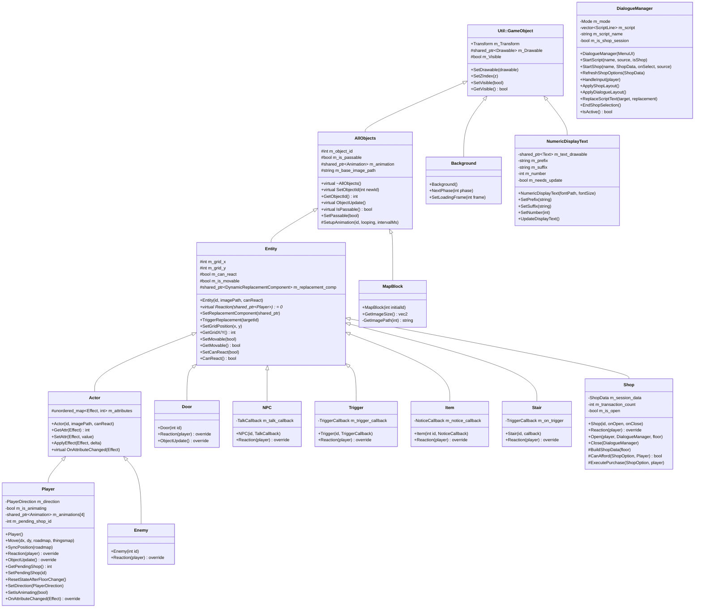
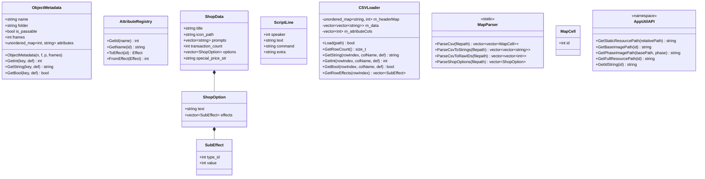

# 魔塔專案架構概覽

## 完整類別圖（繼承、屬性、方法）



## 非繼承類別（管理器與 UI）

```mermaid
classDiagram
    direction TB

    class App {
        -STATE m_current_state
        -GameState m_game_state
        -Renderer m_root
        -shared_ptr~Background~ m_background
        -shared_ptr~FloorMap~ m_road_map
        -shared_ptr~FloorMap~ m_things_map
        -shared_ptr~StatusUI~ m_status_ui
        -shared_ptr~Player~ m_player
        -shared_ptr~MenuUI~ m_menu_ui
        -shared_ptr~DialogueManager~ m_dialogue_manager
        -int m_preview_floor
        -float m_item_notice_timer
        -float m_loading_timer
        -int m_loading_frame
        -Shop* m_active_shop
        +GetCurrentState() STATE
        +Start()
        +Update()
        +End()
        +ChangeFloor(int delta)
        +TeleportToFloor(int story, int stairId)
        +ShowItemNotice(string)
        +HideItemNotice()
        +Restart()
        -ValidTask()
        -InitializeGame()
    }

    class FloorMap {
        -Renderer* m_root
        -ObjectFactory m_factory
        -vector~3D shared_ptr AllObjects~ m_objects
        -int m_current_story
        -float DEFAULT_SIZE
        -vec2 m_base_size
        -float m_center_x/y
        -float m_scale_x/y
        -float m_z_index
        +FloorMap(factory, centerX, centerY, ...)
        +GetBaseSize() vec2
        +LoadFloorData(MapCell / int)
        +GetObject(x, y, story) AllObjects
        +IsPassable(x, y, story) bool
        +SwitchStory(int)
        +Update()
        +GetCurrentStory() int
        +SetObject(x, y, id, story)
        +SetAllVisible(bool)
        +FindFirstObjectPosition(id, story) ivec2
        +FindFirstObjectOfId(id, story) AllObjects
        +SetRenderer(Renderer*)
        +AddToRenderer()
    }

    class MenuUI {
        -MenuType m_current_menu
        -shared_ptr notice_bg / fly_bg / item_notice_bg
        -shared_ptr floor_text / enter_text / quit_text
        -shared_ptr up_arrow / down_arrow
        -shared_ptr item_notice_text / item_confirm_text
        +MenuUI()
        +SetVisible(bool, MenuType)
        +AddToRoot(Renderer)
        +SetTargetFloor(int)
        +SetItemNotice(string)
        +UpdateArrows(int)
        -InitText(text, prefix, x, y, size)
    }

    class StatusUI {
        -shared_ptr yellow/blue/red_key_text
        -shared_ptr coin/level/hp/attack/defense/agility/exp/floor_text
        -shared_ptr manual_hint_text
        -unsigned int m_default_font_size
        +StatusUI(fontSize)
        +Update(Player, floorNum)
        +SetVisible(bool)
        +AddToRoot(Renderer)
        -InitNumericText(text, x, y, color, size)
    }

    class DynamicReplacementComponent {
        -ReplacementCallback m_callback
        +DynamicReplacementComponent(callback)
        +ReplaceWith(x, y, id)
    }

    class RegistryLoader {
        <<static>>
        +LoadAllData()
        +LoadSettings(path)
        +LoadObjectCSV(path, folder, passable)
    }

    class TileAnimationManager {
        <<namespace>>
        +GetGlobalFrame2(ms) int
    }

    class DialogueManager {
        -Mode m_mode
        -vector~ScriptLine~ m_script
        -string m_script_name
        -bool m_is_shop_session
        +DialogueManager(MenuUI)
        +StartScript(name, source, isShop)
        +StartShop(name, ShopData, onSelect, source)
        +RefreshShopOptions(ShopData)
        +HandleInput(player)
        +ApplyShopLayout()
        +ApplyDialogueLayout()
        +ReplaceScriptText(target, replacement)
        +EndShopSelection()
        +IsActive() bool
    }
```



## 使用關係圖

```mermaid
classDiagram
    direction LR

    App ..> RegistryLoader : calls LoadAllData()
    App *-- Background : m_background
    App *-- FloorMap : m_road_map, m_things_map
    App *-- Player : m_player
    App *-- StatusUI : m_status_ui
    App *-- MenuUI : m_menu_ui
    App *-- DialogueManager : m_dialogue_manager
    App ..> Shop : m_active_shop (non-owning)

    FloorMap o-- AllObjects : m_objects (3D grid)
    FloorMap ..> MapBlock : roadObjFactory creates
    FloorMap ..> Entity : thingsObjFactory creates

    AllObjects o-- "Util::Animation" : m_animation (Owned)
    AllObjects ..> ObjectMetadata : SetObjectId loads data

    Entity *-- DynamicReplacementComponent : m_replacement_comp
    Entity ..> ObjectMetadata : notes for NPC/Shop/Enemy sync

    Player ..> FloorMap : SyncPosition / Move
    Player ..> Entity : Reaction via shared_from_this

    Shop ..> DialogueManager : drives UI in Open/Close
    Shop ..> Player : reads & modifies stats

    Door ..> Player : reads attributes in Reaction
    Item ..> Actor : ApplyEffect in Reaction
    Stair ..> App : TriggerCallback→ChangeFloor

    StatusUI *-- NumericDisplayText : 12 text displays
    MenuUI *-- NumericDisplayText : text elements

    RegistryLoader ..> AppUtil : populates GlobalObjectRegistry
    AppUtil o-- ObjectMetadata : Registry holds
```

## 資料結構與元件 (AppUtil Namespace)



---

## 一、基底物件 (`AllObjects`)
- 繼承 `Util::GameObject`。
- **統一驅動核心**：`SetObjectId(int)` 現在負責從 `GlobalObjectRegistry` 載入所有屬性與動畫資源。
- **混合動畫架構**：
  - `m_animation`：持有一個 `Util::Animation` 實體。
  - `SetupAnimation()`：工具方法，自動從 CSV `frames` 欄位與 `AppUtil` 路徑解析器建立動畫。
- **自動同步**：`ObjectUpdate()` 提供預設實作，若物件處於 `PAUSE` 狀態且 `frames > 1`，則自動與 `TileAnimationManager` 的全域時鐘同步。
- **建構子**：保持 `protected` 以確保封裝。

## 二、地圖區塊 (`MapBlock`)
- 繼承 `AllObjects`。最精簡的地磚物件，完全依賴基底類別處理渲染與同步。
- **Z-Index**：固定為 -5。
- **方法**：僅保留 `GetImageSize()` 與 `GetImagePath()`。

## 三、實體基類 (`Entity`)
- 繼承 `AllObjects`。
- **動畫策略**：
  - **NPC、Shop、Enemy**：與場景同步控制（Global Sync）。
  - **Item、Stair、Trigger**：單幀靜態顯示（Static）。
- **覆寫方法**：不再需要覆寫 `SetObjectId` 與 `ObjectUpdate`，完全複用基底類別邏輯。
- **組件持有**：`DynamicReplacementComponent` — 用於物件被消滅後的動態替換。

## 四、多型衍生實體 (Entity 子類)

### 4.0 `Actor` (屬性引擎基類)
- 繼承 `Entity`。所有具備屬性（HP、金錢、鑰匙等）實體的共同基類。
- **屬性容器**：`m_attributes` (`std::unordered_map<AppUtil::Effect, int>`)。
- **核心介面**：
  - `GetAttr(Effect)`: 取得指定屬性，不存在則回傳 0。
  - `SetAttr(Effect, value)`: 強制設定屬性數值。
  - `ApplyEffect(Effect, delta)`: 增量/減量修改屬性（自動調用 `OnAttributeChanged`）。
- **掛鉤**：`virtual OnAttributeChanged(Effect)` — 供子類別監聽屬性變動。
- **建構**：從 `GlobalObjectRegistry` 遍歷 `attributes`，並透過 `AttributeRegistry` 轉換並初始化預設數值。

### 4.1 `Player` (主角)
- 繼承 `Actor` 與 `std::enable_shared_from_this<Player>`。
- **Z-Index**：-3。初始位置 (5, 10)。
- **屬性**：方向 (`PlayerDirection` 枚舉: DOWN/UP/LEFT/RIGHT)、動畫狀態 (`m_is_moving`)、`m_pending_shop_id`。
- **方法**：
  - `Move(dx, dy, roadmap, thingsmap)` — 邊界檢查 → `RoadMap::IsPassable` → `ThingsMap` 實體互動 → 移動/阻擋判斷 → 動畫觸發。
  - `SyncPosition(roadmap)` — 從 `FloorMap` 借用同位置物件的 `m_Transform`。
  - `ResetStateAfterFloorChange()` — 強制重置方向為 DOWN、停止動畫，並切換為去背效果最佳的 `player_1.png`。
  - `OnAttributeChanged(Effect)` override — 監聽 HP 變動。
  - `ObjectUpdate()` override — 驅動單次踏步動畫，並在播放結束時 (`ENDED`) 回歸對應方向的 `.png` 靜止圖片。
  - `SetDirection(PlayerDirection)` — 切換方向並更新圖片。若在靜止狀態，自動載入 `player_{dir}.png` 以確保透明去背正確。
  - `Reaction()` override — 空實作 (Log 提示)。
- **私有**：`UpdateSprite()` — 使用 `AppUtil::GetPhaseImagePath` 從 `bmp/Player/player_{dir}` 取得動態圖片路徑（完美支援擴充與各式副檔名）。

### 4.2 `Door` (門)
- **動畫切換**：建構時調用 `SetupAnimation(id, false, 100)` 進入「原生輪播」模式（One-shot）。
- **`Reaction()` override** — 判定開門條件後調用 `m_animation->Play()`。
- **`ObjectUpdate()` override** — 監聽 `Util::Animation::State::ENDED`，於動畫播完後發起 `TriggerReplacement(0)` 進行路徑打通。
- **`Reaction()` override** — 從 `GlobalObjectRegistry` 讀取通關條件 (`yellow_key, blue_key, red_key` 與 `is_passive`)：
  - 被動門 (`is_passive`) 直接返回。
  - 無需鑰匙的門直接播放開門動畫。
  - 需要鑰匙的門呼叫 `Player::UseKey` 逐一扣除，成功則播放動畫。
- **`ObjectUpdate()` override** — 偵測動畫結束後，透過 `DynamicReplacementComponent` 將自身替換為 ID 0 (空地)。

### 4.3 `Enemy` (怪物)
- **建構**：`Actor(id, "", true)` — 使用自動資源路徑。
- **註記**：**尚未實作全盤戰鬥系統**，目前僅具備 Actor 的數值儲存結構。
- **`Reaction()` override** — 目前記錄 Log + 透過 `DynamicReplacementComponent` 替換為空地。(TODO: 戰鬥邏輯)

### 4.4 `NPC` (NPC)
- **屬性**：`TalkCallback m_talk_callback` — 回傳觸發對話的 callback。
- **建構**：`NPC(id, TalkCallback)` — 傳入自定義的回調函式以處理互動。
- **`Reaction()` override** — 觸發 `m_talk_callback`。若是商人 (如 Thief)，腳本結尾可能包含 `shop` 購買與 `hide` 銷毀指令。

### 4.5 `Item` (道具)
- **建構**：`Item(id, NoticeCallback)` — 設定 `m_notice_callback` 處理獲得物品的單行通知。
- **`Reaction()` override** — 從 `GlobalObjectRegistry` 讀取屬性：
  - 藉由 `GetString("Dialog")` 觸發 `m_notice_callback` 顯示提示。
  - 解析所有動態屬性欄位並轉換為 `SubEffect`，對每個效果呼叫 `Player::ApplyEffect`。
  - 最後透過 `TriggerReplacement(0)` 將自身替換為空地 (消除圖示)。
### 4.6 `Stair` (樓梯)
- **屬性**：`TriggerCallback m_on_trigger` — lambda 回調，指向 `App::ChangeFloor`。
- **`Reaction()` override** — 從 `GlobalObjectRegistry` 讀取屬性 (`floor_delta`)：
  - 呼叫 `m_on_trigger(floor_delta)`。
- **設定**：`m_is_passable = true` (由 CSV 定義)。

### 4.7 `Shop` (商店)
- **屬性**：`ShopData m_session_data`、`m_transaction_count`、`m_is_open`、`m_selection`、`OpenCallback m_on_open`、`CloseCallback m_on_close`。
- **`Reaction()` override** — 僅設定 `Player::SetPendingShop(m_object_id)`，由 `App::Update` 偵測後觸發 `Open()`。
- **Session 生命週期**：
  - `Open()` — 從 `GlobalObjectRegistry` 讀取商店屬性 → `BuildShopData()` → 組合對話與選項 → 呼叫 `DialogueManager::StartShop` 接管 UI → 觸發 `m_on_open`。
  - `Close()` — 呼叫 `DialogueManager::EndShopSelection` 關閉介面 → 觸發 `m_on_close` (回歸 `PLAYING` 狀態)。
- **保護 / 私有方法**：
  - `BuildShopData(floor)` — 從 CSV 載入選項內容，且針對 `PricingType::SCALING_GREED` 計算動態價格並填充至 `special_price_str`，確保對UI上顯示精確對齊。
  - `CanAfford()` — 檢查玩家是否有足夠資源。
  - `ExecutePurchase()` — 呼叫 `Player::ApplyEffect` 執行購買，遞增 `m_transaction_count` 並透過 `DialogueManager::RefreshShopOptions` 同步 UI。

### 4.8 `Trigger` (事件觸發塊)
- **屬性**：`TriggerCallback m_trigger_callback`。
- **建構**：`Trigger(id, TriggerCallback)` — 完全消除程式層級特例，全面依靠 CSV (`Trigger.csv`) 的 `Path` 設定（例如：`air`）交由 `AppUtil::GetFullResourcePath` 決定透明或指定顯示圖案。
- **`Reaction()` override** — 自動發布觸發 `m_trigger_callback`，接續對話腳本解析。

## 五、背景 (`Background`)
- 繼承 `Util::GameObject`。Z-Index = -10。
- `NextPhase(int)` — 切換場景背景圖。
- `SetLoadingFrame(int)` — 播放載入動畫幀 (`loading1~4.BMP`)。

## 六、文字顯示 (`NumericDisplayText`)
- 繼承 `Util::GameObject`。
- **格式**：`Prefix` + (`Number` if `m_show_number`) + `Suffix`。
- **髒標記**：`m_needs_update`，任何 Setter 設定後需手動呼叫 `UpdateDisplayText()` 生效。
- 內部持有 `shared_ptr<Util::Text>` 做實際渲染。

## 七、動態替換組件 (`DynamicReplacementComponent`)
- **獨立類別**（非繼承任何基類）。
- 持有 `ReplacementCallback = function<void(int x, int y, int id)>`。
- `ReplaceWith(x, y, id)` — 呼叫回調，實際指向 `FloorMap::SetObject`。
- 由 `Entity` 持有，`Door/Enemy/Item` 在 `Reaction()` 結束時使用。

## 八、地圖系統 (`FloorMap`)
- **獨立類別**，不繼承任何基類。
- **3D 存儲**：`vector<vector<vector<shared_ptr<AllObjects>>>> m_objects`，索引 `[story][y][x]`，尺寸 `TOTAL_STORY × 11 × 11`。
- **工廠模式**：接收 `ObjectFactory = function<shared_ptr<AllObjects>(int id)>` 建立物件。
  - `roadObjFactory` → 生產 `MapBlock`。
  - `thingsObjFactory` → 依 ID 範圍生產 `Item(200~299)`, `Door(300~399)`, `Enemy(400~499)`, `NPC(500~599)`, `Shop(600~699)`, `Stair(700~799)`, `Trigger(800~899)`。
- **核心方法**：
  - `LoadFloorData()` — 接收 CSV 解析結果，替換更新網格物件。
  - `SwitchStory(int)` — 隱藏當前樓層物件、顯示新樓層物件。
  - `Update()` — 遍歷當前樓層所有可見物件呼叫 `ObjectUpdate()`。
  - `SetObject(x, y, id)` — 動態替換單格物件 (由 `DynamicReplacementComponent` 呼叫)。
  - `FindFirstObjectPosition(id)` / `FindFirstObjectOfId(id)` — 搜尋物件座標/指標。
- **排版校準**：取樣 ID 0 物件尺寸決定 11×11 網格間距。

## 九、App (遊戲核心控制器)
- **狀態機**：`App::STATE` (START/UPDATE/END) 控制生命週期，`AppUtil::GameState` 控制遊戲邏輯狀態。
- **GameState 列舉**：`MAIN_MENU(0)` → `LOADING(5)` → `PLAYING(1)` ↔ `INSTRUCTIONS(2)` / `FAST_ELEVATOR(3)` / `ITEM_DIALOG(4)` / `SHOP(6)`。
- **初始化流程** (`InitializeGame`)：
  1. 建立 `roadObjFactory` / `thingsObjFactory`。
  2. 從 CSV 載入所有樓層地圖數據至 `m_road_map` 與 `m_things_map`。
  3. 初始化 `StatusUI`、`Player`、`MenuUI`。
- **按鍵分配**：
  - WASD / 方向鍵 → 移動 / 選單導航。
  - F → 快速電梯 (`FAST_ELEVATOR`)，需具備 `m_player->HasFly()` 條件。
  - G → 快速電梯 (`FAST_ELEVATOR`)，無條件除錯專用。
  - L → 說明書 (INSTRUCTIONS)。
  - R → 重新開始。
  - ESC → 退出 / 關閉商店。
- **商店流程**：`Player::Reaction` 設定 `m_pending_shop_id` → `App::Update` 偵測後呼叫 `Shop::Open` → 觸發 `onOpen` 切換 `GameState::SHOP` → `DialogueManager` 接管 UI 與輸入 → `Shop::Close` 回歸 `PLAYING`。
- **即時 UI 同步**：`App::Update` 在每幀結束前，若處於 PLAYING/SHOP/ITEM_DIALOG 狀態，會強制呼叫 `m_status_ui->Update` 確保數值即時更新。
- `ChangeFloor(delta)` — 切換樓層並同步玩家位置。
- `TeleportToFloor(story, stairId)` — 傳送至指定樓層的指定樓梯座標。
- `Restart()` — 重置所有狀態，回到 `MAIN_MENU`。

## 十、UI 系統

### 10.1 `StatusUI` (狀態面板)
- **獨立類別**，持有 12 個 `NumericDisplayText` 實例。
- 顯示：等級、HP、ATK、DEF、AGI、EXP、黃/藍/紅鑰匙、金幣、樓層、操作提示 `-Press (L)-`。
- `Update(Player, floorNum)` — 從 `Player` 讀取所有數值並刷新文字。
- Z-Index = -3 (StatusUI 文字)、-0.1 (提示文字)。

### 10.2 `MenuUI` (選單覆蓋層)
- **獨立類別**，管理所有模態覆蓋選單。
- **MenuType 枚舉**：`NONE`, `NOTICE`, `FAST_ELEVATOR`, `ITEM_NOTICE`。
- **子面板**：
  - **Notice Panel** (Z=90)：顯示 `notice.bmp` 說明書背景。
  - **Fast Elevator Panel** (Z=90~92)：電梯背景 + 樓層數字 + 上下箭頭 + Enter/Quit 提示。
  - **Item Notice Panel** (Z=90~91)：`itemDialog.bmp` 背景 + 獲得物品文字 + `-Space-` 確認提示。
- `SetVisible(bool, MenuType)` — 先隱藏所有子元件，再依 MenuType 顯示對應面板。

## 十一、對話管理系統 (`DialogueManager`)
- **統一介面**：由 `App` 持有，集中處理所有對話、選擇與通知。
- **屬性**：`m_mode` (SCRIPT/SELECTION/NOTICE), `m_script`, `m_current_line`, `m_script_name` (當前腳本名), `m_on_selection` (選擇回調), `m_is_shop_session` (是否為純商店啟動)。
- **UI 組件**：包含背景圖、NPC 頭像、說話者名稱、對話內容、動態價格 (`m_price_text`)，以及一個會閃爍的 `-Space-` 繼續提示。元件皆使用**絕對座標**定位。
- **腳本解析功能**：
  - **多行自動合併**：`AdvanceScript` 會自動將連續 3 行內同一個說話者的對話合併顯示，並以 `\n` 換行。
  - **說話者辨識**：首欄為 `0` 表示玩家（勇者），`1` 表示 NPC。其餘則視為指令。
  - **指令標籤**：
    - `item` (給予物品)：給予對應 ID 的道具或數值，並快取提示文字。
    - `shop` (開啟商店)：自動連結 `<script_name>_option.csv` 開啟交易介面。支援腳本內置購買邏輯與價格同步。
    - `hide` (銷毀 NPC)：執行 `SourceEntity->TriggerReplacement(0)` 使 NPC 消失。
- **動態佈局與 Session 管理**：
  - `ApplyShopLayout()` / `ApplyDialogueLayout()`：根據內容切換 UI 元件位置。
  - `EndShopSelection()`：若為腳本嵌入模式且仍有後續指令（如小偷腳本末尾的 `hide`），則呼叫 `AdvanceScript` 續行；否則關閉 UI 設為 `INACTIVE`。
- **全域同步**：
  - 接手商店對白合併、價格佔位符 (`　　　`) 替換等邏輯，確保 Greed God 等動態價格能正確在劇情對白中顯示。

## 十二、層級控制 (Z-Index 渲染順序)
| Z-Index | 層級 | 內容 |
|---------|------|------|
| 90 ~ 92 | UI 頂層選單 | `MenuUI` 背景、文字、箭頭、`DialogueManager` 內容 |
| -0.1 | UI 提示層 | `StatusUI` 操作提示文字 |
| -2 | Entity 預設層 | `Entity` 基底預設 Z-Index |
| -3 | 主角層/狀態層 | `Player` 實例、`StatusUI` 數值 |
| -4 | 物件層 | `ThingsMap` (怪物、道具、NPC、樓梯、商店) |
| -5 | 地板層 | `RoadMap` (牆壁、地板、岩漿) |
| -10 | 背景層 | `Background` 場景圖 |

## 十三、數據驅動層 (`AppUtil::RegistryLoader`)
- **單一事實來源**：`GlobalObjectRegistry` (`unordered_map<int, ObjectMetadata>`)。
- **啟動加載**：`LoadAllData()` 清空並透過 `LoadObjectCSV` 從 CSV 重填，支援動態重啟重置。
- **通用加載機制**：
  - `AttributeRegistry`：動態分配並緩存以字串為主鍵的屬性 ID，取代舊有寫死的 Enum 結構。
  - 統一透過 `LoadObjectCSV` 將 CSV 表格標頭作為 Key，儲存至 `ObjectMetadata::attributes`。
- **資源定位與解耦 API**：統一取代舊有的硬編碼路徑，全權動態識別副檔名（`.png`, `.bmp`）。
  - `GetBaseImagePath(id)`：依 `ObjectMetadata` 取得無後綴基準目錄與檔名（例：`bmp/Door/red_door`）。
  - `GetPhaseImagePath(basePath, phase)`：附加動畫幀數並進行多格式副檔名碰撞偵測（`.png`, `.bmp`, `.PNG`, `.BMP`），回傳可以直接使用的絕對路徑。
  - `GetFullResourcePath(id)`：封裝上述兩者，透過全域時間系統動態結算出當前最終呈現的絕對路徑。
  - `GetStaticResourcePath(relPath)`：針對非物件註冊表的靜態檔案，保證帶有系統前綴修飾。
- **多樣化效果**：利用 `AttributeRegistry` 彈性支援 HP, ATK, DEF, AGI, EXP, Level, Keys, Coins, Weak, Poison，擴充不再需要修改程式碼。
- **CSV 解析器 (`MapParser` 與 `CSVLoader`)**：
  - `CSVLoader::Load()` → 載入為帶有標頭屬性對應表的動態結構。
  - `CSVLoader::GetRowEffects()` → 自動篩選非結構欄位並轉換為 `SubEffect`。
  - `ParseCsv()` → `vector<vector<MapCell>>` (整數 ID 地圖)。
  - `ParseShopOptions()` → `vector<ShopOption>` (商店選項與效果)。

## 十四、交互觸發流程
1. `Player::Move()` 嘗試移動。
2. 邊界檢查 (11×11 網格)。
3. 檢查 `RoadMap::IsPassable()` (牆壁阻擋)。
4. 檢查 `ThingsMap` 目標物件：呼叫 `Entity::Reaction()`。
5. **穿透與阻擋條件**：
   - 若物件為不可通行且 Reaction 後仍為 `Visible` → 阻擋移動。
   - 若物件 `IsPassable()` 為 `true` (樓梯、物品) → 允許重疊。
6. 成功移動 → 更新 `m_grid_x/y` → `SyncPosition()` → 觸發走路動畫。

## 十五、全域常數與工具
| 常數 | 值 | 說明 |
|------|----|------|
| `WINDOW_WIDTH` | 1200 | 視窗寬度 |
| `WINDOW_HEIGHT` | 800 | 視窗高度 |
| `TOTAL_STORY` | 26 | 總樓層數 (0~25) |

- **`TileAnimationManager::GetGlobalFrame2(ms)`** — 依全域時間回傳 1 或 2 (兩幀切換動畫)。
- **`main.cpp`** — `Core::Context` 主迴圈驅動 `App::Start/Update/End`。

## 十六、檔案清單

### include/ (18 個標頭檔)
| 檔案 | 類別 | 角色 |
|------|------|------|
| `AllObjects.hpp` | `AllObjects` | 所有地圖物件基類 |
| `App.hpp` | `App` | 遊戲核心控制器 |
| `AppUtil.hpp` | namespace `AppUtil` | 元數據、組件、工具、常數 |
| `Background.hpp` | `Background` | 場景背景 |
| `Door.hpp` | `Door` | 門實體 |
| `DynamicReplacementComponent.hpp` | `DynamicReplacementComponent` | 動態替換組件 |
| `Enemy.hpp` | `Enemy` | 怪物實體 |
| `Entity.hpp` | `Entity` | 互動實體基類 |
| `FloorMap.hpp` | `FloorMap` | 多樓層地圖管理 |
| `Item.hpp` | `Item` | 道具實體 |
| `MapBlock.hpp` | `MapBlock` | 地板/牆壁方塊 |
| `MenuUI.hpp` | `MenuUI` | 選單覆蓋層 |
| `NPC.hpp` | `NPC` | NPC 實體 |
| `NumericDisplayText.hpp` | `NumericDisplayText` | 數字/文字顯示 |
| `Player.hpp` | `Player` | 主角 |
| `Shop.hpp` | `Shop` | 商店實體 |
| `Stair.hpp` | `Stair` | 樓梯實體 |
| `StatusUI.hpp` | `StatusUI` | 狀態面板 |
| `DialogueManager.hpp` | `DialogueManager` | 統一對話與通知管理器 |
| `Trigger.hpp` | `Trigger` | 隱形事件觸發塊 |

### src/ (20 個原始檔)
| 檔案 | 對應類別 | 說明 |
|------|---------|------|
| `main.cpp` | — | 程式進入點 |
| `App.cpp` | `App` | 遊戲主迴圈、狀態機、初始化 |
| `AppUtil.cpp` | `AppUtil` | 全域註冊表、CSV 解析器、RegistryLoader |
| `AllObjects.cpp` | `AllObjects` | 建構子實作 |
| `Entity.cpp` | `Entity` | 建構子、屬性更新、動畫更新 |
| `MapBlock.cpp` | `MapBlock` | ID 切換、動畫幀同步 |
| `FloorMap.cpp` | `FloorMap` | 地圖載入、樓層切換、物件搜尋 |
| `Player.cpp` | `Player` | 移動、碰撞、效果套用、動畫 |
| `Door.cpp` | `Door` | 開門動畫、鑰匙扣除、動態替換 |
| `Enemy.cpp` | `Enemy` | 戰鬥(TODO)、動態替換 |
| `NPC.cpp` | `NPC` | 對話(TODO) |
| `Item.cpp` | `Item` | 效果套用、對話觸發、動態替換 |
| `Stair.cpp` | `Stair` | 樓層切換觸發 |
| `Shop.cpp` | `Shop` | 商店 Session 完整流程 |
| `Background.cpp` | `Background` | 場景/載入圖切換 |
| `NumericDisplayText.cpp` | `NumericDisplayText` | 文字渲染邏輯 |
| `DynamicReplacementComponent.cpp` | `DynamicReplacementComponent` | 回調執行 |
| `MenuUI.cpp` | `MenuUI` | 選單初始化、顯隱、數據綁定 |
| `StatusUI.cpp` | `StatusUI` | 數值刷新、文字初始化 |
| `DialogueManager.cpp` | `DialogueManager` | 腳本解析、對話流程、通知攔截 |
| `Trigger.cpp` | `Trigger` | 自動觸發回調邏輯 |

