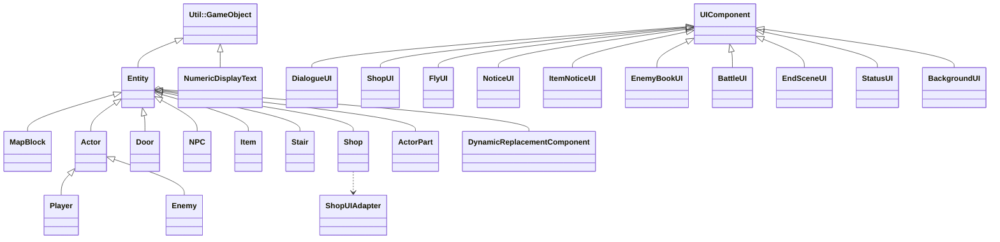
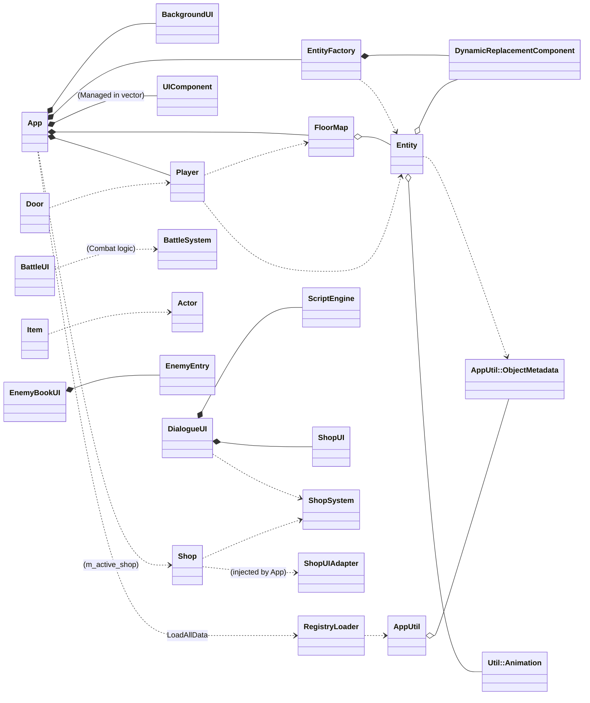

# 魔塔專案架構概覽

## 簡明繼承架構圖 (Hierarchy Overview)

這是一份省略了屬性與方法的純繼承關聯圖，供快速掌握類別層級關係：

```mermaid
classDiagram
    direction TB
    class GameObject["Util::GameObject"]
    class Entity
    class UIComponent

    GameObject <|-- Entity
    GameObject <|-- NumericDisplayText
    
    Entity <|-- MapBlock
    Entity <|-- Actor
    Entity <|-- Door
    Entity <|-- NPC
    Entity <|-- Item
    Entity <|-- Stair
    Entity <|-- Shop
    Entity <|-- ActorPart

    Actor <|-- Player
    Actor <|-- Enemy

    UIComponent <|-- DialogueUI
    UIComponent <|-- ShopUI
    UIComponent <|-- FlyUI
    UIComponent <|-- NoticeUI
    UIComponent <|-- ItemNoticeUI
    UIComponent <|-- EnemyBookUI
    UIComponent <|-- BattleUI
    UIComponent <|-- EndSceneUI
    UIComponent <|-- StatusUI
    UIComponent <|-- BackgroundUI

    %% 元件（非繼承）
    Entity o-- DynamicReplacementComponent
    Shop ..> ShopUIAdapter
```

## 完整類別圖（繼承、屬性、方法）

```mermaid
classDiagram
    direction TB

    class GameObject["Util::GameObject"] {
        +Transform m_Transform
        #shared_ptr~Drawable~ m_Drawable
        #bool m_Visible
        +SetDrawable(drawable)
        +SetZIndex(z)
        +SetVisible(bool)
    }

    class UIComponent {
        <<interface>>
        #bool m_visible
        #float m_blink_timer
        +virtual run()*
        +virtual IsIntercepting()* bool
        +virtual IsActive()* bool
        +virtual SetVisible(bool)*
        +virtual AddToRoot(Renderer)*
        #UpdateBlinkTimer()
        #IsBlinkVisible() bool
        #ResetBlinkTimer()
    }

    class Entity {
        #int m_object_id
        #bool m_is_passable
        #shared_ptr~Animation~ m_animation
        #string m_base_image_path
        #int m_grid_x
        #int m_grid_y
        #bool m_can_react
        #bool m_is_movable
        #shared_ptr~DynamicReplacementComponent~ m_replacement_comp
        +Entity(id, canReact)
        +virtual ~Entity()
        +virtual SetObjectId(int newId)
        +GetObjectId() int
        +virtual ObjectUpdate()
        +virtual IsPassable() bool
        +SetPassable(bool)
        #SetupAnimation(id, looping, intervalMs)
        +virtual Reaction(shared_ptr~Player~)
        +SetReplacementComponent(shared_ptr)
        +TriggerReplacement(targetId)
        +SetGridPosition(x, y)
        +GetGridX() int
        +GetGridY() int
        +GetGridPosition() ivec2
        +GetMovable() bool
        +SetMovable(bool)
        +CanReact() bool
        +SetCanReact(bool)
        +virtual ShouldSkipWalkAnimation() const bool
        +virtual CheckCondition(shared_ptr~Player~) const bool
        +virtual InterruptsMovementSync() const bool
        +ForEachAttribute(callback) const
    }

    class Actor {
        #unordered_map~Effect, int~ m_attributes
        +Actor(id, canReact)
        +virtual GetAttr(Effect) int
        +virtual SetAttr(Effect, value)
        +virtual ApplyEffect(Effect, delta)
        +MeetsRequirement(Effect, amount) bool
        +virtual OnAttributeChanged(Effect)
    }

    class Player {
        -PlayerDirection m_direction
        -bool m_is_animating
        -shared_ptr~Animation~ m_animations[4]
        -bool m_is_super_mode
        -bool m_is_weak
        -bool m_is_poisoned
        -unordered_map~Effect, int~ m_super_attributes
        -shared_ptr~Image~ m_giraffe_image
        +Player()
        +Move(dx, dy, roadmap, thingsmap)
        +SyncPosition(roadmap)
        +Reaction(player) override
        +ResetStateAfterFloorChange()
        +SetDirection(PlayerDirection)
        +SetIsAnimating(bool)
        +HasFly() const bool
        +IsSuperMode() const bool
        +GetIsWeak() const bool
        +SetIsWeak(bool)
        +GetIsPoison() const bool
        +SetIsPoison(bool)
        +ToggleSuperMode()
        +ObjectUpdate() override
        +GetAttr(Effect) int override
        +SetAttr(Effect, value) override
        +ApplyEffect(Effect, delta) override
        +OnAttributeChanged(Effect) override
    }

    class Enemy {
        -function m_start_battle_cb
        -function m_load_reward_layer_cb
        +Enemy(id)
        +Reaction(player) override
        +OnDefeated(player)
        +SetBattleCallback(cb)
        +SetRewardCallback(cb)
    }

    class Door {
        +Door(id)
        +CheckCondition(player) const bool override
        +Reaction(player) override
        +ObjectUpdate() override
    }

    class Item {
        -NoticeCallback m_notice_callback
        +Item(id, NoticeCallback)
        +Reaction(player) override
    }

    class NPC {
        -TalkCallback m_talk_callback
        +NPC(id, TalkCallback)
        +Reaction(player) override
    }

    class Stair {
        -TriggerCallback m_on_trigger
        -bool m_isRelative
        +Stair(id, TriggerCallback)
        +Reaction(player) override
        +ShouldSkipWalkAnimation() const bool override
        +IsRelative() const bool
        +InterruptsMovementSync() const bool override
    }

    class Shop {
        -AppUtil::ShopData m_session_data
        -int m_transaction_count
        -bool m_is_open
        -int m_selection
        -TriggerCallback m_on_trigger
        -CloseCallback m_on_close
        -ShopUIAdapter m_adapter
        +Shop(id, onTrigger, onClose)
        +Reaction(player) override
        +Open(player, ShopUIAdapter, floor)
        +Close()
        +IsOpen() const bool
        +GetSelectionIndex() const int
        #BuildShopData(floor)
        #CanAfford(ShopOption, player) const bool
        #ExecutePurchase(ShopOption, player)
    }

    class ActorPart {
        -shared_ptr~DynamicReplacementComponent~ m_replacement_comp
        -int m_core_id
        +ActorPart(id, coreId)
        +Reaction(player) override
        +CheckCondition(player) const override
    }

    class MapBlock {
        +MapBlock(int initialId)
        +GetImageSize() vec2
        -GetImagePath(int) string
    }

    class DialogueUI {
        -Mode m_mode
        -ScriptEngine m_engine
        -unique_ptr~ShopUI~ m_shop_ui
        -shared_ptr~Player~ m_player
        +DialogueUI(ItemNoticeUI)
        +SetPlayer(shared_ptr~Player~)
        +StartScript(name, source, isShop)
        +StartShop(name, ShopData, onSelect, source)
        +SetOnSwitchObject(callback)
        +run() override
        +IsIntercepting() bool override
        +IsActive() bool override
        +SetVisible(bool) override
        +AddToRoot(Renderer) override
        -HandleNPCShopSelection(int)
    }

    class ShopUI {
        -vector~shared_ptr~NumericDisplayText~~ m_options
        -shared_ptr~GameObject~ m_selector
        -shared_ptr~NumericDisplayText~ m_price_display
        -AppUtil::ShopData m_data
        -int m_selection
        +ShopUI(fontPath)
        +Start(ShopData, onSelect)
        +run() override
        +IsIntercepting() bool override
        +IsActive() bool override
        +SetVisible(bool) override
        +Refresh(ShopData)
    }

    class FlyUI {
        -shared_ptr~Player~ m_player
        -int m_current_story
        -int m_preview_floor
        -shared_ptr~GameObject~ m_fly_bg
        -shared_ptr~NumericDisplayText~ m_floor_text
        -shared_ptr~NumericDisplayText~ m_enter_text
        -shared_ptr~NumericDisplayText~ m_quit_text
        -shared_ptr~GameObject~ m_up_arrow
        -shared_ptr~GameObject~ m_down_arrow
        +FlyUI()
        +SetPlayer(player)
        +Start(currentStory, callback)
        +run() override
        +IsIntercepting() bool override
        +IsActive() bool override
        +SetVisible(bool) override
        +AddToRoot(Renderer) override
    }

    class NoticeUI {
        -shared_ptr~GameObject~ m_notice_bg
        -shared_ptr~NumericDisplayText~ m_close_hint
        +NoticeUI()
        +run() override
        +IsIntercepting() bool override
        +IsActive() bool override
        +SetVisible(bool) override
        +AddToRoot(Renderer) override
    }
    
    class ItemNoticeUI {
        -shared_ptr~GameObject~ m_item_notice_bg
        -shared_ptr~NumericDisplayText~ m_item_notice_text
        -shared_ptr~NumericDisplayText~ m_item_confirm_text
        +ItemNoticeUI()
        +Show(text)
        +run() override
        +IsIntercepting() bool override
        +IsActive() bool override
        +SetVisible(bool) override
        +AddToRoot(Renderer) override
    }

    class EnemyBookUI {
        -struct EnemyEntry m_entries[3]
        -vector~int~ m_unique_enemy_ids
        -int m_current_page
        -int m_total_pages
        +EnemyBookUI(player, thingsMap)
        +run() override
        +IsIntercepting() const override
        +IsActive() const override
        +SetVisible(bool) override
        +Unlock()
        +AddToRoot(Renderer) override
        +Refresh()
    }

    class BattleUI {
        -shared_ptr~Player~ m_player
        -shared_ptr~Enemy~ m_enemy
        -State m_state
        -bool m_is_frozen
        -int m_enemy_hits_remaining
        -float m_defeat_timer
        +BattleUI(fontPath)
        +Start(player, enemy, onEnd)
        +run() override
        +IsIntercepting() const override
        +IsActive() const override
        +SetVisible(bool) override
        +AddToRoot(Renderer) override
        -RefreshStats()
        -SetAnimation(isPlayerTurn, damage)
    }

    class EndSceneUI {
        -bool m_is_win
        -shared_ptr~GameObject~ m_background
        -shared_ptr~NumericDisplayText~ m_status_text
        -shared_ptr~NumericDisplayText~ m_restart_hint
        +EndSceneUI(fontPath)
        +Show(bool win)
        +CanRestart() const bool
        +run() override
        +IsIntercepting() const override
        +IsActive() const override
        +SetVisible(bool) override
        +AddToRoot(Renderer) override
    }

    class StatusUI {
        -vector~StatEntry~ m_stat_entries
        -shared_ptr~NumericDisplayText~ m_tower_text
        -shared_ptr~NumericDisplayText~ m_floor_num_text
        -shared_ptr~NumericDisplayText~ m_floor_suffix
        -shared_ptr~NumericDisplayText~ m_manual_hint_text
        -shared_ptr~GameObject~ m_player_icon
        -shared_ptr~NumericDisplayText~ m_status_text
        -unsigned int m_default_font_size
        -shared_ptr~Player~ m_player
        -shared_ptr~FloorMap~ m_road_map
        -float m_poison_timer
        +StatusUI(player, floorMap, fontSize)
        +run() override
        +IsIntercepting() const override
        +IsActive() const override
        +SetVisible(bool) override
        +AddToRoot(Renderer) override
        +Update(player, floorNum)
        -MakeText(x, y, color, size)
    }

    class BackgroundUI {
        +BackgroundUI()
        +NextPhase(int phase)
        +SetLoadingFrame(int frame)
        +StartLoading()
        +run() override
        +SetVisible(bool) override
        +AddToRoot(Renderer) override
        -ImagePath(int) string
    }

    class NumericDisplayText {
        -shared_ptr~Text~ m_text_drawable
        -string m_prefix
        -string m_suffix
        -int m_number
        -bool m_show_number
        -bool m_show_text
        -Align m_align
        -bool m_needs_update
        +NumericDisplayText(fontPath, fontSize)
        +SetPrefix(string)
        +SetSuffix(string)
        +SetNumber(int)
        +SetShowNumber(bool)
        +SetShowText(bool)
        +SetAlignLeft(bool)
        +SetAlignment(Align)
        +GetPrefix() string
        +GetNumber() int
        +SetColor(Color)
        +UpdateDisplayText()
    }

    %% ── 繼承關係 ──
    GameObject <|-- Entity
    GameObject <|-- NumericDisplayText
    Entity <|-- MapBlock
    Entity <|-- Door
    Entity <|-- NPC
    Entity <|-- Item
    Entity <|-- Stair
    Entity <|-- Shop
    Entity <|-- ActorPart

    Entity <|-- Actor
    Actor <|-- Player
    Actor <|-- Enemy
    UIComponent <|-- DialogueUI
    UIComponent <|-- ShopUI
    UIComponent <|-- FlyUI
    UIComponent <|-- NoticeUI
    UIComponent <|-- ItemNoticeUI
    UIComponent <|-- EnemyBookUI
    UIComponent <|-- BattleUI
    UIComponent <|-- EndSceneUI
    UIComponent <|-- StatusUI
    UIComponent <|-- BackgroundUI
```

## 非繼承類別（管理器與 UI 整合中心）

```mermaid
classDiagram
    direction TB

    class App {
        -STATE m_current_state
        -GameState m_game_state
        -Renderer m_root
        -shared_ptr~BackgroundUI~ m_background
        -shared_ptr~FloorMap~ m_road_map
        -shared_ptr~FloorMap~ m_things_map
        -shared_ptr~StatusUI~ m_status_ui
        -shared_ptr~Player~ m_player
        -shared_ptr~FlyUI~ m_fly_ui
        -shared_ptr~NoticeUI~ m_notice_ui
        -shared_ptr~ItemNoticeUI~ m_item_notice_ui
        -shared_ptr~DialogueUI~ m_dialogue_ui
        -shared_ptr~EnemyBookUI~ m_enemy_book_ui
        -shared_ptr~BattleUI~ m_battle_ui
        -shared_ptr~EndSceneUI~ m_end_scene_ui
        -float m_item_notice_timer
        -Shop* m_active_shop
        -vector~shared_ptr~UIComponent~~ m_ui_components
        -unique_ptr~EntityFactory~ m_entity_factory
        +Start()
        +Update()
        +End()
        +Restart()
        +ChangeFloor(int delta)
        +SetFloor(int story, int x, int y)
        +TeleportToFloor(int targetStory, int targetStairId)
        +ShowItemNotice(text)
        +HideItemNotice()
        -InitializeGame()
        -ValidTask()
        -UpdateHighestFloor()
    }

    class FloorMap {
        -string m_path_prefix
        -vector~bool~ m_floor_loaded
        +FloorMap(factory, centerX, centerY, scaleX, scaleY, zIndex)
        +LoadAllFloors(prefix)
        +LoadFloorData(floorData, story)
        +LoadOverlay(relativePath, story)
        +SwitchStory(story)
        +GetObject(x, y, story) Entity
        +IsPassable(x, y, story) bool
        +SetObject(x, y, id, story)
        +SetAllVisible(visible)
        +FindFirstObjectPosition(id, story) ivec2
        +FindFirstObjectOfId(id, story) shared_ptr~Entity~
        +SetRenderer(Renderer*)
        +AddToRenderer()
        +GetGridAbsolutePosition(x, y) vec2
        +Update()
        -EnsureFloorLoaded(story)
        -UpdateObjectAt(x, y, id, story)
    }

    class ScriptEngine {
        -vector~ScriptStep~ m_steps
        -size_t m_currentIndex
        +LoadScript(name)
        +ReplaceText(target, replacement)
        +HasNext() bool
        +Next() ScriptStep
        +Peek() const ScriptStep
        +Reset()
        +Clear()
        +InjectStep(step)
        +GetSteps() vector~ScriptStep~
        +GetCurrentIndex() size_t
        +SetCurrentIndex(index)
        +GetSize() size_t
    }

    class ShopSystem {
        <<static>>
        +LoadFromStaticFile(name) ShopData
        +LoadForShopEntity(id, floor, transCount) ShopData
        -ApplyDynamicPricing(shopId, transCount, data)
        -ParseShopOptions(filepath) vector~ShopOption~
        -GetOptionPath(name) string
        -AddDefaultOptions(data)
    }

    class BattleSystem {
        <<static>>
        +ProcessPlayerTurn(player, enemy) TurnResult
        +ProcessSingleEnemyHit(player, enemy) TurnResult
        +ProcessEnemyTurn(player, enemy) TurnResult
    }

    class EntityFactory {
        -Callbacks m_callbacks
        -shared_ptr~DynamicReplacementComponent~ m_replacement_comp
        +CreateEntity(id) shared_ptr~Entity~
        +SetReplacementComponent(comp)
        -CreateRoadBlock(id) shared_ptr~Entity~
        -CreateItem(id) shared_ptr~Entity~
        -CreateDoor(id) shared_ptr~Entity~
        -CreateEnemy(id) shared_ptr~Entity~
        -CreateNPC(id) shared_ptr~Entity~
        -CreateShop(id) shared_ptr~Entity~
        -CreateStair(id) shared_ptr~Entity~
    }

    class DynamicReplacementComponent {
        +DynamicReplacementComponent(callback, find_callback)
        +ReplaceWith(x, y, id)
        +FindEntityById(id) shared_ptr~Entity~
        -ReplacementCallback m_callback
        -FindEntityCallback m_find_callback
    }

    class RegistryLoader {
        <<static>>
        +LoadAllData()
        +LoadSettings(path)
        +LoadObjectCSV(path, folder, passable)
    }
```

## 資料結構與元件 (AppUtil Namespace)

```mermaid
classDiagram
    class ObjectMetadata {
        +string name
        +string folder
        +bool is_passable
        +int frames
        +unordered_map~int, string~ attributes
        +ObjectMetadata(n, f, p, frames)
        +GetInt(key, def) int
        +GetString(key, def) string
        +GetBool(key, def) bool
    }

    class AttributeRegistry {
        <<static>>
        +GetId(name) int
        +GetName(id) string
        +ToEffect(id) Effect
        +FromEffect(Effect) int
        +Initialize()
        +IsAttribute(name) bool
    }

    class SubEffect {
        +int type_id
        +int value
    }

    class ShopOption {
        +string text
        +vector~SubEffect~ effects
    }

    class ShopData {
        +string title
        +string icon_path
        +vector~string~ prompts
        +int transaction_count
        +int max_transactions
        +vector~ShopOption~ options
        +string special_price_str
    }

    class ScriptStep {
        +Speaker speaker
        +string text
        +CommandType command
        +string extra
    }

    class CSVLoader {
        -vector~vector~string~~ m_data
        -unordered_map~string, int~ m_headerMap
        -vector~int~ m_attributeCols
        +Load(path) bool
        +GetRowCount() size_t
        +GetString(rowIndex, colName, def) string
        +GetInt(rowIndex, colName, def) int
        +GetBool(rowIndex, colName, def) bool
        +GetRowEffects(rowIndex) vector~SubEffect~
        +GetHeaderMap() unordered_map~string,int~
    }

    class TurnResult["BattleSystem::TurnResult"] {
        +bool evading
        +bool instantKill
        +bool weakened
        +bool poisoned
        +int totalDamage
        +bool isBattleEnd
        +int rewardExp
        +int rewardCoin
    }

    class AppUtilAPI {
        <<namespace>>
        +GlobalObjectRegistry
        +GlobalSettings
        +GlobalPathCache
        +GetStaticResourcePath(relativePath) string
        +GetBaseImagePath(id) string
        +GetPhaseImagePath(basePath, phase) string
        +GetFullResourcePath(id) string
        +GetIdString(id) string
        +CalculateDamage(player, enemyId) long long
        +GetGlobalString(key, defaultValue) string
        +GetRandomInt(min, max) int
        +CheckProbability(percentage) bool
        +ResetGameVariables()
        +GetMaxGlobalFrame() int
    }

    class TileAnimationManager {
        <<static>>
        +GetGlobalFrame2(intervalMs) int
    }

    class MapParser {
        <<static>>
        +ParseCsv(filepath) vector~vector~int~~
        +ParseCsvToStrings(filepath) vector~vector~string~~
    }

    class GameState {
        <<enum>>
        MAIN_MENU
        PLAYING
        INSTRUCTIONS
        FAST_ELEVATOR
        ITEM_DIALOG
        LOADING
        SHOP
        ENEMY_BOOK
        BATTLE
        GAME_OVER
        WIN
    }

    class SkinConstants {
        <<namespace>>
        +SUPER_MODE_PATH
        +SUPER_MODE_RATIO
    }

    ShopOption *-- SubEffect
    ShopData *-- ShopOption
```

## 系統架構組件關係圖

```mermaid
classDiagram
    direction LR
    class Animation["Util::Animation"]
    class ObjectMetadata["AppUtil::ObjectMetadata"]

    App ..> RegistryLoader : LoadAllData
    App *-- BackgroundUI
    App *-- FloorMap
    App *-- Player
    App *-- UIComponent : (Managed in vector)
    App *-- EntityFactory
    App ..> Shop : (m_active_shop)

    DialogueUI *-- ScriptEngine
    DialogueUI *-- ShopUI
    DialogueUI ..> ShopSystem
    Shop ..> ShopSystem
    Shop ..> ShopUIAdapter : (injected by App)
    BattleUI ..> BattleSystem : (Combat logic)

    EntityFactory ..> Entity
    EntityFactory *-- DynamicReplacementComponent
    FloorMap o-- Entity
    Entity o-- Animation
    Entity o-- DynamicReplacementComponent
    Entity ..> ObjectMetadata

    Player ..> FloorMap
    Player ..> Entity
    Door ..> Player
    Item ..> Actor

    class EnemyEntry
    EnemyBookUI *-- EnemyEntry

    RegistryLoader ..> AppUtil
    AppUtil o-- ObjectMetadata
```

---

## 一、互動實體基類 (`Entity`)
- 繼承 `Util::GameObject`。
- **統一驅動核心 (`SetObjectId`)**：負責從 `GlobalObjectRegistry` 載入 CSV 中的所有屬性與動畫資源。
- **解耦行為標記與預覽**：
  - `ShouldSkipWalkAnimation()`：行為標記，決定玩家進入此格子時是否跳過走路動畫。
  - `CheckCondition(player)`：**互動預覽**，用於在執行 Reaction 前檢查資格（預設回傳 `true`）。
  - `InterruptsMovementSync()`：**多型位移中斷**，用以打斷同步 (如樓層傳送後)。
- **屬性解析工具 (`ForEachAttribute`)**：集中處理由 CSV 字串鍵值到 Enum 的轉譯並應用回調。
- **自動同步 (`ObjectUpdate`)**：預設實作，透過 `PAUSE` 動畫狀態與全域時鐘進行圖片影格同步。

## 二、地圖區塊 (`MapBlock`)
- 繼承 `Entity`。極度精煉的環境裝飾類別。
- `GetImageSize()`：取得讀入的地磚素材長寬比例與大小。

## 三、實體衍生與策略
- 動畫策略透過繼承覆寫，主要分為隨系統時鐘的 **Global Sync** (如 NPC/商店) 及 **Static** (如 道具)。

## 四、多型衍生實體 (Entity 子類)
- `Actor`: 所有動態數值實體的基類。
  - `GetAttr` / `SetAttr`：統一的狀態存取介面。
  - `ApplyEffect`：增減指定維度的狀態數據。
  - `MeetsRequirement`：在需要消耗資源前（如商店購買、開門），檢查狀態存量是否達標。
- `Player`: 玩家控制器類別，與地圖連結。
  - `Move`：處理網格碰撞與多型實體的 `CheckCondition` 檢查。
  - `SyncPosition`：根據當下網格座標，向地圖請求並同步目前實際畫面像素座標。
  - `ToggleSuperMode`：切換超級模式，於內部獨立維護一份 `m_super_attributes` 字典。
  - `GetIsWeak` / `SetIsWeak`：操作**表層處理的弱化狀態** (`m_is_weak`)，不永久修改基礎屬性，供 `BattleSystem` 在戰鬥中檢查計算。
  - `GetIsPoison` / `SetIsPoison`：操作**中毒狀態** (`m_is_poisoned`)，由 `StatusUI` 的 `m_poison_timer` 定時扣除 HP。
- `Stair`: 資料驅動式樓梯與傳送。
  - `Reaction`：驅動換層或座標變更。
  - `IsRelative`：判斷該實體為相對樓梯 (+1/-1 樓) 或絕對座標傳送門。
- `Door`:
  - `CheckCondition`：判斷啟動該門所需的屬性（自動從 CSV 解析所需顏色與把手種類）。
  - `Reaction`：調用 Animator 與 DynamicReplacement 銷毀自身並變回空地。
- `Shop`：商店實體類別，自行管理實體層商店相互作用。
  - `Open`：透過注入的 `ShopUIAdapter`（包裝函式）啟動 `DialogueUI` 的商店模式，實現實體與 UI 層徹底解耦。
  - `BuildShopData`：根據 `m_transaction_count` 動態組建 `ShopData` 並委實 `ShopSystem` 處理定價。

## 五、背景 (`BackgroundUI`) 與 文字顯示 (`NumericDisplayText`)
- **BackgroundUI** (`NextPhase`, `StartLoading`, `run`)：繼承自 UIComponent，負責背景底圖的渲染並處理 Loading 載入動畫。
- **NumericDisplayText** (`SetPrefix`, `SetSuffix`, `SetAlignment`)：封裝繁雜的字串拼接與對齊，可以直接修改數字與前後輟，並對齊。

## 六、怪物手冊 (`EnemyBookUI`)
- 繼承 `UIComponent`。封裝了針對 `EnemyEntry` 元件的多重處理。
- `Refresh`：即時掃描資料夾構建模版，呼叫全局計算器帶入當前玩家狀態計算預估傷害並重繪清單。
- `UpdatePage`：管理分頁顯示，每頁呈現最多 3 筆敵人資訊（`ENTRIES_PER_PAGE=3`、`STAT_COUNT=8` 均為靜態常數）。
- `EnemyEntry` (inner struct)：每格條目含圖示、名稱、特殊技能文字、及 8 項數值文字，統一由 `Update(meta, player)` 重繪。

## 七、UI 模組化介面 (`UIComponent`)
- 作為核心 UI 抽象層，徹底消滅了每個 UI 各自維護 `m_visible` 的龐大冗餘。
- `run()`：抽象主迴圈，強迫所有子類各自實現邏輯與渲染刷新。
- `IsIntercepting()`：判定是否攔截玩家腳步停滯（預設阻斷地圖事件）。
- `SetVisible()`, `IsActive()`：統一的啟動與狀態查詢。
- `UpdateBlinkTimer()`, `IsBlinkVisible()`：統一發配所有提示文字（如 "請按空白鍵"）的閃爍頻率計時器。

## 八、業務隔離與系統架構 (System Layer)
作為專案架構演進的重要里程碑，我們將核心演算邏輯徹底從 UI 繪製層中剝離，落實 View - Logic 拆離：
- **BattleSystem**: 處理回合制戰鬥演算的純邏輯模組。
  - `ProcessPlayerTurn`：玩家攻擊回合，計算傷害並判斷敵人是否死亡，回傳獎勵。
  - `ProcessSingleEnemyHit`：敵人包含多段攻擊機制。此方法將單撇打擊獨立處理，包括獨立閃避判定 (AGI%)、傷害計算、狀態觸發（中毒/弱化），並直接對玩家准印 HP，供 `BattleUI` 定時器每撇調用。
  - `ProcessEnemyTurn`：包裝器，內部多次呼叫 `ProcessSingleEnemyHit`，保留相容。
  - **`TurnResult` (inner struct)**：記錄單回合所有結果（閃避、秒殺、弱化、中毒、傷害值、獎勵等）。
- **ShopSystem**: 集中接管商店與交易資料。
  - `LoadFromStaticFile` / `LoadForShopEntity`：依據交易對象與發生之樓層，動態生成並回傳型別安全的 `ShopData` 結構給 `ShopUI` 刷新介面。
  - `ApplyDynamicPricing`：針對特定商店（如貪神）處理按交易次數遞增的動態定價機制。
- **DynamicReplacementComponent**: 誑身實體層的地圖替換元件。
  - `ReplaceWith(x, y, id)`：透過註冊的回呼函式對 `FloorMap` 發起替換指令。
  - `FindEntityById(id)`：查找特定 ID 的實體共享指標，供多段實體 (`ActorPart`) 連結核心實體使用。
- **ShopUIAdapter**: 標準的函式採集條。暴露給 `Shop` 物件，使其不需 include 任何 UI header 即可啟動 / 刷新 / 關閉商店展示。

## 九、數據驅動層 (Data-Driven Layer)
本專案已完全剔除 Hardcode 的判斷式，改以 CSV 表單作為唯一 Truth Source 進行實體生成。
- **RegistryLoader**:
  - `LoadAllData`：於啟動階段載入所有的地形、怪物、道具表，實例化出 `GlobalObjectRegistry` 全局定義檔。
- **CSVLoader**:
  - `GetRowEffects` / `GetString` / `GetBool`：封裝字串解析，將純文字的配置無縫轉換為系統辨識的 Enum `AppUtil::Effect`。
  - `GetHeaderMap`：回傳標頭索引映射，供進階欄位篩選使用。
- **AppUtilAPI**:
  - `CalculateDamage`：提供全域的預測傷害函數，供 `EnemyBookUI` 即時且無副作用地估算戰局。
  - `GetPhaseImagePath`：實作了 **全域路徑快取 (GlobalPathCache)**，將讀取過的實體檔案路徑暫存於記憶體，大幅消弭了切換樓層時的硬碟 I/O 負載。
  - `ResetGameVariables`：遊戲重新開始時，統一重置所有全域狀態（含 `GlobalSettings`、`GlobalPathCache`）。
  - `GetRandomInt` / `CheckProbability`：集中管理的 RNG 工具函式，供戰鬥閃避、狀態觸發等機率計算呼叫。
- **TileAnimationManager**:
  - `GetGlobalFrame2`：以全域毫秒時鐘計算 2 格動畫的當前 Frame，驅動地圖磚的統一動畫節奏。
- **MapParser**:
  - `ParseCsv` / `ParseCsvToStrings`：將地圖 CSV 解析為 `vector<vector<int>>` 或字串二維陣列供 `FloorMap` 使用。

## 十、專案總結 - 穩定化機制與未來展望 (Conclusion & Stability)
經歷了深度的架構清洗，《魔塔》專案在效能、擴展性及使用者體驗上已達到極佳的狀態：
- **集中化 UI 介面 (`UIComponent::run`)**：以單一陣列由 `App` 派發更新，根除了過往四處散落的計時器與閃爍異常。
- **輸入保護 (Release Guard)**：在 `App` 狀態機切換時嚴格執行「放開偵測」，確保 `Space` 或快捷鍵 (如 `F`, `G`) 在完全釋放前不會導致模組被連續重覆呼叫，徹底消滅了 Frame Bounce 問題。
- **分段攻擊架構 (`ProcessSingleEnemyHit`)**：將敵人多段攻擊的每一撇獨立排程至 `BattleUI` 定時器內處理，使閃避、傷害顯示、死亡判定均能逐撇獨立呈現，大幅提升戰鬥視覺回饋的精確度。
- **狀態效果二元化 (`m_is_weak` / `m_is_poisoned`)**：弱化與中毒狀態以獨立布林值儲存在 `Player`，前者影響戰鬥計算、後者由 `StatusUI` 定時扣 HP，兩者均不永久修改屬性表，確保狀態解除後能完整恢復。

總結而言，目前的架構靈活結合了 Entity-Component 的設計概念與 Data-Driven 的延遲載入機制。這份高度解耦、統一化介面的核心系統，為未來擴充任何新樓層、新怪物技能或全新型態的機制，打下了最穩健的基礎。
